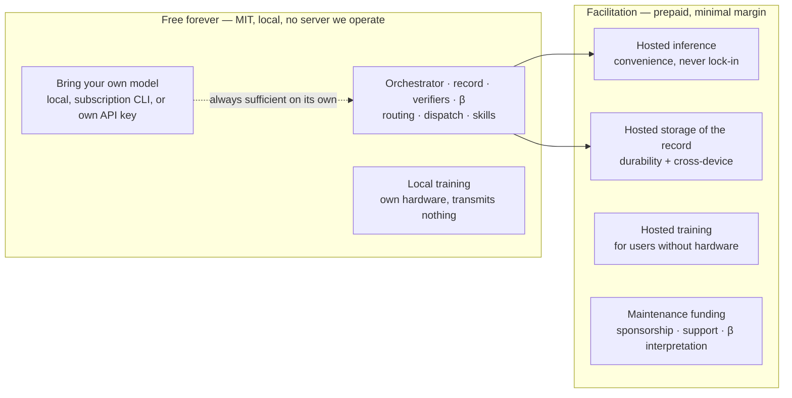
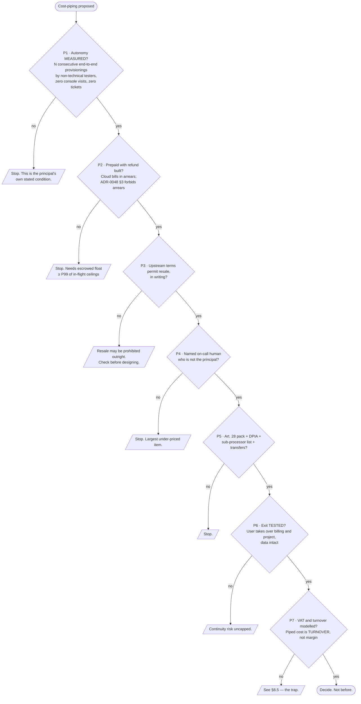
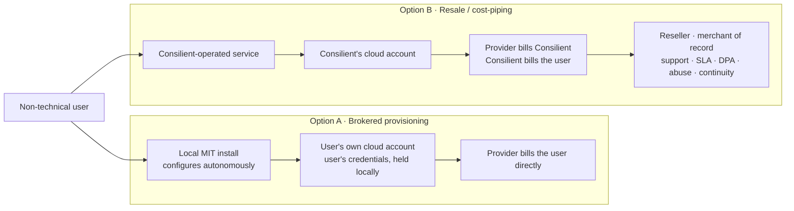

# The business model, as end-state

- **Document class:** W (written, judgement-bearing) under ADR-0073. Not generated, not a
  state projection. Every claim carries an evidence tag.
- **Status:** DESCRIPTIVE. **This document decides nothing.** It records the principal's
  stated end-state, reconciles it against the decisions already on record, and prices the
  comparables. Where it names an amendment to an ADR, that amendment is *proposed for the
  principal's signature*, not made. Filing decisions under his name that he did not make is
  a failure this repository has measured three times (ADR-0073, Context). [measured]
- **Date:** 2026-08-23
- **Author:** Claude dispatch, CTO audit worktree. The principal has not reviewed this.
- **Falsifier:** if a costed unit-economics model shows minimal margin cannot cover variance
  at any realistic volume, §4 is wrong and either the margin rises or the hosted offering does
  not exist (ADR-0048, "What would overturn this"). If the autonomy precondition in §8 is met,
  §8's own rationale collapses — see §8.6, which is the sharpest finding here.
- **Review by:** 2027-02-23. After that date treat this as *known-stale*, not current.
- **Nothing here is legal, tax or financial advice. The author is not a solicitor, an
  accountant or an FCA-authorised person.** `docs/legal/README.md` already carries eleven
  questions for a solicitor; §7 and §8 add six more that are not in that brief.

---

## 1. The principal's stated end-state

Recorded 23 August 2026, **relayed through the orchestrator rather than read from a file in
this repository.** That provenance matters: the words below have not been verified against a
primary record and are marked accordingly. [asserted]

> - Open source first. Paid plans exist to fund maintenance, storage and hosted inference at
>   MINIMAL margins — the Open Design approach. Full value from plugging in your own models;
>   hosted models offered as a convenience, not a lock-in.
> - LONG-TERM, EXPLICITLY NOT V1: piping cloud costs with a small margin (GCP, Supabase,
>   Firebase) as a management, orchestration and risk fee — but only if ALL cloud configuration
>   barring critical auth logins and financial decisions is autonomous, so a non-technical user
>   never navigates a cloud console. Queued far beyond the open-source release.
> - Nothing paid gets BUILT yet. Paid capability is planned, documented and designed as part of
>   the end-state, where the project moves from development into maintenance.

He said "open source first" three times unprompted on 20 August, which ADR-0048 already
records as the constraint rather than the caveat. [measured: ADR-0048, Context] The 23 August
statement is consistent with it and adds two things ADR-0048 does not cover: **storage** as a
funded line, and **cloud cost-piping** as a distinct commercial category.

---

## 2. What already exists, and is right

This is not a blank page. Four decisions already carry most of the load, and the honest
finding is that **the model is largely written; what is missing is arithmetic, comparables and
the reseller analysis.**

| Decision | What it fixes | Standing |
|---|---|---|
| ADR-0004 | MIT, DCO required, CLA question open before the first external PR | PROPOSED [measured] |
| ADR-0019 | Paid capability acquisition: off by default, four conjunctive conditions | PROPOSED [measured] |
| ADR-0024 | **No capability is ever withheld from the open-source version.** Forecloses open-core. Telemetry off, consent per purpose, per-use re-consent for commercial gain | PROPOSED [measured] |
| ADR-0048 | Open source first as a *test*; charge only for facilitation; **prepaid, never in arrears**; minimal margin sized to solvency not profit; `consilient.dev` | **ACCEPTED** [measured] |

ADR-0048 is accepted; the rest are proposed. That asymmetry is itself worth noting — **the
strongest commercial constraint in the repository is the only one the principal has signed.**
[measured]

`docs/00-context/product-bar-2026-08-22.md` already holds a competitor pricing table with real
figures (Claude Pro US$20/month, Max US$100/US$200; Cursor US$20/US$60/US$200; Devin US$20/US$200;
Manus US$20 for 4,000 credits). [cited, in-repo] That is a bar already found. It should be
re-checked, not re-searched.

---

## 3. What is free forever, and why

### 3.1 The rule

**Every capability. Without exception, without a limit lifted, without a licence key.**

ADR-0024 §1 states it and ADR-0048 §1 turns it into a test: *every capability must be fully
usable by someone who pays nothing, runs locally, and never contacts a server we operate.* A
feature that only works hosted is a feature built wrong. [measured: ADR-0048 §1]

### 3.2 Why, stated as a mechanism rather than a value

Three reasons, in descending order of how much it would cost to be wrong about them.

1. **The CLA depends on it.** `docs/legal/RELICENSING-PROMISE.md` asks contributors to grant a
   relicensing right, and the promise is what makes that politically survivable. The moment
   contributors suspect their work is building an upsell path, contribution stops — ADR-0024
   §1 states this and ADR-0023's deliberately strict contribution gates depend on it being
   true rather than claimed. [measured: ADR-0024]
2. **The measured precedent says paywalling the core costs more than it earns.** See §6.3.
3. **It forces the architecture local-first**, which is also what makes offline operation and
   user-owned training coherent rather than bolted on. [measured: ADR-0048, Consequences]

### 3.3 What "free" concretely includes

- The orchestrator, the record, every surface that renders it, every verifier, β measurement,
  routing, dispatch, work items, skills.
- **Bring-your-own-model at full value** — see §5, which is the load-bearing one.
- Local training on the user's own hardware, free and unfacilitated, transmitting nothing.
  [measured: ADR-0048 §5]
- The zero-cost routing ladder (ADR-0088): `Z0_LOCAL`, then `Z1_FREE_KEY`, then subscription,
  and a zero-cash request **cannot** enter the metered rung. [measured: ADR-0088]

---

## 4. What the paid tier funds, and the minimal-margin principle

### 4.1 The three lines



**Maintenance** is the line ADR-0048 does not name and the principal now does. It is not
facilitation — there is no per-user cost to attribute — so it cannot be priced by the
cost-plus rule. It is funded by whatever margin the other lines throw off, plus sponsorship,
support, and the β-interpretation service ADR-0024 §4.3 already identifies as the best fit.
[measured: ADR-0024 §4]

**Storage** is new and is the easiest line to price honestly, because object storage has a
published unit cost and near-zero variance. It is also the line most likely to grow without
anyone noticing: an append-only record that never deletes is an append-only bill.

### 4.2 What "minimal margin" has to mean arithmetically

"Minimal" is not a number, and a principle without an arithmetic is a slogan. The smallest
honest definition:

```
price(unit) = unit_cost × (1 + variance_buffer) + payment_fee + tax_handling
```

- `unit_cost` is a **quoted** figure from the provider's published pricing on a dated retrieval,
  never a recalled one. This document does not quote GCP per-GB figures because the fetch
  returned a truncated page on 2026-08-23 and a recalled number is an assertion wearing a
  number's clothes (principle 10). [measured — the fetch failed]
- `variance_buffer` is the smallest value that survives a bad month, defined as the P95 of
  monthly realised cost over the trailing year. Before there is a trailing year it is a
  declared guess, tagged `[asserted]`, and revised on the first anniversary.
- `payment_fee` is not optional and is larger than people expect. OpenRouter charges **5.5%
  with a $0.80 minimum** on Stripe credit purchases and **5%** on crypto — while charging
  **no markup on inference at all**. [cited: openrouter.ai/docs/faq, retrieved 2026-08-23]
  That split is the cleanest published example of the model the principal is describing: pass
  the commodity through at cost, recover the cost of *taking money* separately and visibly.
- `tax_handling` — see §8.5. On a piped model this is where the trap is.

**Publish all four terms.** Ghost publishes live ARR, customer count and monthly run rate on
its public about page. [cited: ghost.org/about, retrieved 2026-08-23] A minimal-margin claim
that cannot be checked is a trust-me claim, and ADR-0024's own final forbidden item is
"asserting trustworthiness in place of constraining behaviour". [measured: ADR-0024 §5]

### 4.3 Prepaid is the load-bearing clause, and it constrains storage badly

ADR-0048 §3: cost *and* margin collected before the work starts. No invoicing, no overage, no
credit. The reason is structural, not preferential — *"billing in arrears requires attribution
to work perfectly. Billing in advance does not."* [measured: ADR-0048]

Inference and training fit this: they are jobs with a ceiling. **Storage does not.** Storage
is a standing obligation with no job boundary. Prepaid storage has exactly two honest shapes:

1. **Prepaid capacity, expiring.** The user buys N GB-months up front; when the balance reaches
   zero the record stops accepting new writes and remains readable and exportable for a stated
   grace period. Never deleted without an explicit user act.
2. **Prepaid subscription, fixed allowance.** A flat monthly fee bought in advance covering an
   allowance; exceeding it stops writes rather than billing more.

Both are refuse-closed, matching ADR-0044's budget primitive shape — no ceiling means *no*, not
unlimited. [measured: ADR-0048, ADR-0044] **Neither has been designed, and "the record stops
accepting writes" is a user-visible failure mode needing its own design pass.** An append-only
record that silently stops appending is worse than one that refuses loudly.

---

## 5. Bring-your-own-model users get full value, and here is the test

This is the promise most likely to erode, because it erodes by accretion rather than by
decision. Every open-core company has felt the pull toward making the hosted path quietly
better; ADR-0048's own "Evidence against" says so. [measured]

### 5.1 The guarantee

A user who supplies their own model — local weights, a subscription CLI they already pay for,
or their own API key — gets **the entire product**. Not a degraded tier. Not a nag. Not a
slower path. Every verifier, every routing decision, every surface, β measurement, the record,
and hosted-equivalent quality wherever quality is a function of the model rather than of us.

### 5.2 The checks that make it a fact rather than an intention

ADR-0048 already names four; the others follow from principle 3 — a chokepoint without an
enforcement rule is not a chokepoint.

| # | Check | Status |
|---|---|---|
| C1 | No capability requires a network call to a Consilient-operated service | named in ADR-0048, **not built** [measured] |
| C2 | No facilitated job starts without settled prepayment covering its ceiling | named in ADR-0048, **not built** [measured] |
| C3 | Quoted ceiling and actual consumed cost both recorded per job | named in ADR-0048, **not built** [measured] |
| C4 | Local training path never transmits user data off-device | named in ADR-0048, **not built** [measured] |
| C5 | **No code path degrades, delays or annotates a BYO-model route relative to a hosted one.** A lint on the routing ladder: hosted providers get no priority term the user did not set | **not named anywhere** — proposed here [asserted] |
| C6 | **The hosted feature list is generated from the free feature list**, so a hosted-only entry is a build failure rather than a product decision | **not named anywhere** — proposed here [asserted] |

C5 and C6 are the ones that catch erosion, because erosion does not arrive as a hosted-only
feature. It arrives as a default that happens to favour the paid path.

### 5.3 The credential rule already forbids the obvious shortcut

`docs/20-design/frontend-concepts-kimi-2026-08-20.md` R12 refuses **cloud custody of the user's
provider credentials, under any plan**, citing the principal's 20 August rule that a capability
needing a secret runs locally or not at all. [measured — it is the recorded rule] That refusal
is correct and it has a commercial consequence people miss: **Consilient can never offer "we'll
run your Anthropic key for you".** The hosted inference offering must be Consilient's own
capacity, resold, not the user's key operated by proxy.

---

## 6. Comparables: what open-source-first projects charge, and what they learned not to paywall

Real figures, all retrieved 2026-08-23. **These are the bar. They should be re-checked,
because incumbents move.** [cited]

### 6.1 The ones that fund a project rather than a company

| Project | Structure | Numbers | What it tells us |
|---|---|---|---|
| **Ghost** | Non-profit foundation; *"the company can never be bought or sold, and one hundred percent of our revenue is reinvested into the product and the community"* | **ARR $11,055,673 · 30,557 customers · $921,306/month run rate** → ≈ **$362 per customer per year** | The closest structural analogue to the principal's stated end-state, and it is solvent at eight figures. Publishing financials live is what makes "reinvested" checkable rather than claimed. [cited: ghost.org/about] |
| **Home Assistant / Nabu Casa** | Commercial arm funds the Open Home Foundation | **$6.50/month or $65/year** (US); **€7.50 / €75** (EU, VAT incl.) | A remote-access and voice convenience layer priced at the level of a coffee, funding a large open-source project. The paid thing is *reachability*, not capability. [cited: nabucasa.com/pricing] |
| **OpenRouter** | Pass-through broker | **No markup on inference.** 5.5% ($0.80 min) on Stripe credit purchase, 5% crypto. BYOK: 5% on usage above a **$25,000/month** free allowance (pay-as-you-go) | The purest published "minimal margin" implementation in the market: commodity at cost, fee on the *transaction*, BYOK explicitly free to a very high ceiling. [cited: openrouter.ai/docs/faq] |
| **Cline** | Open-source extension, optional inference credits | *"The Cline open source extension is completely free for individual developers"*; BYOK across a dozen providers; **markup on the Cline provider is not published** | ADR-0048 cites Cline and Roo Code as the model but records that neither has been studied. Partially closed here: the extension is free and BYOK is first-class; the unpublished markup is the gap — and an unpublished markup is precisely what a minimal-margin claim cannot have. [cited: cline.bot/pricing] |

### 6.2 The one that shows what a resold-infrastructure price actually looks like

**Supabase** — the nearest live example of the cost-piping shape, reselling hyperscaler
infrastructure to people who never see a console:

- Free $0 · Pro **$25/month** · Team **$599/month** · Enterprise quoted
- Free tier: 500 MB database, 1 GB file storage, 5 GB egress, 50,000 MAU
- Overages: database storage **$0.125/GB**, file storage **$0.0213/GB**, egress **$0.09/GB**,
  cached egress **$0.03/GB**; compute from **$10/month** (Micro) to $3,730+ (16XL), billed hourly
- Pro and Team include $10/month of compute credits

[cited: supabase.com/pricing] The file-storage figure is the instructive one: **$0.0213/GB sits
within a few percent of raw hyperscaler object-storage list price**, which is an existence proof
that a public, near-cost storage number is commercially survivable. The margin is recovered on
compute and on the plan fee, not on the commodity.

### 6.3 What they learned NOT to put behind a paywall

Two large, dated, self-reported reversals. Both companies paywalled the core; both walked it
back within three years.

**Redis.** Moved to SSPL in **March 2024**. Rowan Trollope, 1 May 2025:

> *"This achieved our goal — AWS and Google now maintain their own fork — but **the change hurt
> our relationship with the Redis community**. SSPL is not truly open source because the Open
> Source Initiative clarified it lacks the requisites to be an OSI-approved license."*

Redis 8 added **AGPLv3** and folded the previously separate, differently licensed Redis Stack
features — JSON, Time Series, probabilistic types, the Query Engine — back into the AGPL core.
[cited: redis.io/blog/agplv3, published 2025-05-01] **The features that had been the open-core
boundary were given away**, and the stated reason was that maintaining two tracks *"split the
developer experience and slowed progress on core Redis"*.

**Elastic.** Moved to ELv2/SSPL in 2021, added **AGPL** in August 2024. Shay Banon:

> *"We had issues with AWS and the market confusion their offering was causing... 3 years later,
> Amazon is fully invested in their fork, the market confusion has been (mostly) resolved."*

He records that they knew the change *"would result in a fork of Elasticsearch with a different
name"* — and it did: OpenSearch. [cited: elastic.co/blog/elasticsearch-is-open-source-again]

**The generalisable lessons, tagged honestly:**

1. `[cited]` **Paywalling the core buys a fork, and the fork is permanent.** Both companies got
   the commercial outcome they wanted — the hyperscaler left — and both paid with a community
   rupture they then spent years repairing. Neither undid the fork.
2. `[cited]` **A two-track licence split costs engineering velocity**, in Redis's own words. The
   open-core boundary is not free to maintain; it is a permanent tax on every feature.
3. `[cited]` **Where a paywall is durable, it is around enterprise administration, not
   capability.** PostHog's published position: paywall *"security, permissioning, compliance, or
   other enterprise-style upgrades"*; keep free the things that make users sticky and that
   *"users would struggle to recreate elsewhere"*; and explicitly refuse to charge per extra
   user — *"the more people we get inside PostHog, the better."* PostHog also states plainly
   that it accepts *"we might not fully understand our cost base and make money on every product
   on day one"*, which is the honest version of minimal margin.
   [cited: posthog.com/handbook/engineering/feature-pricing]
4. `[asserted]` **ADR-0024 §1 is stricter than every one of these companies**, PostHog included.
   It forecloses even the enterprise-administration paywall. That is a real commercial cost,
   chosen deliberately, and it should be defended as a choice rather than presented as the only
   ethical option. Ghost is the evidence it can work; Redis and Elastic are the evidence that
   the alternative costs more than it looks.

---

## 7. Licence implications

### 7.1 What MIT permits

MIT permits everything in §4. A hosted service around an MIT project needs no relicensing at
all, because operating software is not distributing it. [cited: `LICENSE`, MIT text] The
Relicensing Promise commitment 2 — *"Relicensing applies only to derivative or downstream
works... It will not be used to close the Project itself"* — is undisturbed by any of §4.
[measured: `docs/legal/RELICENSING-PROMISE.md`]

### 7.2 The CLA question the business model actually settles

`docs/legal/README.md` Q2 asks whether a CLA is needed at all, and frames it as depending on
whether the commercial plan is *a service around* an MIT project or *a derivative* of it.
[measured] **The end-state described here is entirely the former.** Hosting, storage, hosted
inference, hosted training and cloud brokerage are all services around the project. None
requires relicensing anyone's contribution.

That is a finding, and it points away from the current draft: **on the stated end-state, the
CLA is insurance against a plan change, and the plan has now been stated.** Dropping it and
saying so publicly is, in ADR-0004's own words, *"itself a community-building asset"*.
[measured: ADR-0004, What would overturn this]

**Counter-argument, stated fairly:** the CLA is cheap now and impossible later; ADR-0004's
"Consequences" is right about that. A hosted product's roadmap can drift into a derivative
without anyone declaring it. Keeping the CLA costs contributor goodwill; dropping it costs an
option that cannot be bought back. This is a genuine preference question with an asymmetric
cost — exactly the class ADR-0033 reserves for the principal. This document does not decide it;
it removes the excuse that the commercial plan is unknown.

### 7.3 Third-party licence hygiene already has machinery

`docs/legal/adopted-components.json` records eleven components with licence, verification date
and an accept/refuse status, and has already **refused two** — `anthropics/skills` document
skills (all rights reserved, no redistribution) and `mcp-router` (Sustainable Use, not open
source). [measured] That is a working control and it extends unchanged to a hosted offering.

One thing it does not cover: **a hosted service can lawfully use components it may not
redistribute.** Both refusals above are redistribution refusals. If the hosted path ever uses a
component the MIT path cannot bundle, that is an open-source-first breach dressed as a
licensing detail, and C1/C6 in §5.2 are what should catch it.

---

## 8. Cloud cost-piping — the far-future end-state

### 8.1 What is being proposed

Consilient buys GCP / Supabase / Firebase capacity on its own account, provisions and operates
it on a user's behalf, and charges the user cost plus a small margin described as *"a
management, orchestration and risk fee"*. The user never navigates a cloud console.

### 8.2 What it makes Consilient

**A reseller and a merchant of record.** That is not a pricing change; it is a change of legal
character, and six things follow that do not follow from hosting one's own software:

1. **Contractual counterparty for someone else's outage.** When GCP has an incident, the user's
   contract is with Consilient. Google's SLA credits flow to Consilient; the user's expectation
   flows to Consilient too, and those two numbers are not the same number.
2. **Support obligation, unbounded and 24/7.** Cloud infrastructure fails at 3am. A solo
   maintainer in England is not a support organisation. **This is the single largest under-priced
   item in the proposal.** [asserted]
3. **Margin risk in the wrong direction.** Prepaid protects against a user not paying. It does
   not protect against Consilient having quoted a ceiling below actual consumption, a provider
   price rise mid-term, or a chargeback after the compute is spent.
4. **Data-protection role change.** Consilient becomes a processor — plausibly a controller —
   for workloads on its account: UK GDPR Article 28 terms, a sub-processor list, a DPIA,
   international-transfer machinery, and breach notification for infrastructure it did not
   build. None of this exists in `docs/legal/`. [measured — the files do not exist]
5. **Abuse liability.** Resold anonymous compute is a mining and spam magnet, and the upstream
   holds Consilient responsible for it.
6. **Continuity risk transferred to users.** If Consilient stops, the user's infrastructure
   stops. That is a materially different failure from "the software is unmaintained", which a
   fork can fix.

### 8.3 The preconditions, stated as tests rather than hopes



Every branch reading "stop" is a **cheap** refusal today and an **expensive** discovery later.
That asymmetry is the whole reason to write this now and build none of it.

### 8.4 Where it collides with decisions already on record

| Collision | Detail |
|---|---|
| **ADR-0048 §3 — prepaid, never in arrears** | GCP, Supabase and Firebase all bill in arrears, and most of their cost lines are unbounded until consumed. Piping requires a prepaid ceiling with refund of the unused remainder — which ADR-0048's own "Evidence against" already flags as *"harder to build than a meter"* for training runs. Infrastructure is strictly worse: it has no job boundary at all. [measured] |
| **ADR-0019 condition 2** | *"The user has agreed to the specific legal terms of the specific provider... The agent never clicks through terms on anyone's behalf."* Piping is precisely the design where the user never sees the provider's terms. It is **not** a breach — under resale the user contracts with Consilient, so there is one set of terms, Consilient's — but it satisfies the condition by *removing the provider from the user's view*, which relocates the risk rather than discharging it. That needs saying out loud in an amendment, not left to be inferred. [measured] |
| **ADR-0024 §1 — no capability withheld** | Piping withholds nothing: the same infrastructure can be provisioned by a free local install into the user's own account. Compatible — **provided §8.6's Option A is what gets built.** |
| **frontend-concepts R12** | *"Cloud custody of the user's provider credentials, under any plan."* Piping does not breach this — Consilient holds its **own** cloud credentials, not the user's. But it creates a large privileged-credential store on a Consilient-operated service, and the principal's rule that a capability needing a secret *"runs locally or it does not run"* was written about this repository, not about a hosted service. **The boundary of that rule must be restated by him before piping, or it will be crossed by inference** — which this repository has recorded happening twice. [measured: `AGENTS.md`, "Never do"] |
| **Gate B** | Gate B governs depending on the harness for work on another repository, and is not passed. Autonomous cloud configuration on paying users' behalf is a strictly larger dependence than that. Piping sits far downstream of Gate B, and the sequencing belongs in whichever ADR eventually decides it. [measured] |

### 8.5 The tax trap, named because it is the one that surprises people

**Piped cost is turnover, not margin.** If Consilient bills a user £1,000 of GCP consumption
plus £50 of fee, UK VAT registration thresholds and accounting treatment look at the £1,050,
not the £50. A piping business crosses registration thresholds at roughly one twentieth of the
volume a fee-only business does, while earning one twentieth of the revenue. Agency-versus-principal
treatment can change this and is exactly the question to put to an accountant. **This is not tax
advice and the author is not an accountant.** [asserted]

Proposed additions to `docs/legal/README.md` for the reviewer:

- **Q12** — principal vs agent treatment for resold cloud consumption.
- **Q13** — VAT place-of-supply for resold digital infrastructure to consumers in multiple jurisdictions.
- **Q14** — whether prepaid balances constitute e-money or a regulated payment service.
- **Q15** — Article 28 processor terms for Consilient-operated infrastructure.
- **Q16** — whether the upstream providers' terms permit resale at all.
- **Q17** — insolvency and continuity obligations to users whose infrastructure Consilient holds.

### 8.6 The finding that matters most: the precondition dissolves the rationale

The principal's precondition is that **all cloud configuration barring critical auth logins and
financial decisions must be autonomous.** Take it seriously and follow it through.

If the system can autonomously configure a cloud project end to end, then **the free, local, MIT
install can do it too** — into the user's own cloud account, with the user's own credentials,
held locally, never leaving their machine. ADR-0024 §1 and ADR-0048 §1 *require* that it can. So
the autonomy precondition, once met, delivers the entire user-facing benefit — never navigating a
console — **for free, with no reseller position, no liability, no support obligation and no
margin risk.**

What is left to charge for is then exactly one thing: **not needing a cloud account.**

That residual is real and valuable to genuinely non-technical users. But it is the pure reseller
position with none of the technical work attached — Consilient would be charging for the billing
relationship and the risk absorption, and nothing else. That is an honest product and it is also
the maximally liable one. There is no middle version where you take some of the liability for some
of the revenue: the moment Consilient's name is on the cloud account, the whole of §8.2 applies.

So the decision, when it arrives, is a clean binary and should be written as one:

| Option | What Consilient charges for | Liability | Prerequisite |
|---|---|---|---|
| **A · Brokered provisioning** *(recommended)* | Nothing new. Autonomous configuration ships free in the MIT install, into the user's own account. Revenue stays on §4's lines. | None beyond today | P1 only |
| **B · Resale / cost-piping** | The billing relationship and risk absorption, for users with no cloud account | All of §8.2 | P1–P7, all seven |

**Option A is not a compromise on the vision.** It delivers the stated user experience — a
non-technical user never navigates a cloud console — in full. It differs only in whose name is on
the invoice, and that difference is where every risk in §8.2 lives.



### 8.7 What would make Option B wise, and what would make it a mistake

**Wise if, and only if, all of these hold at once:**

- P1 is **measured**, not asserted: a stated number of consecutive end-to-end provisionings by
  non-technical testers, zero console visits, zero support tickets, published.
- There is a named on-call human who is not the principal, funded before the first customer.
- The margin is sized to cover chargebacks, abuse write-offs and support — which is **not** a
  small margin, and calling it one would be dishonest. If the honest number is not small, say so
  and price it, or do not offer it.
- Users can exit with infrastructure intact, and the exit has been *tested*, not designed.
- The upstream providers' terms permit resale, in writing.
- Demand has been measured. Nobody has costed anything — ADR-0048 says so in terms — and nobody
  has asked whether the users who want this exist. [measured]

**A mistake if any of these are true:**

- It is being done to solve a revenue problem. A reseller business entered from weakness cannot
  afford the support obligation it has just acquired.
- It is being done before Gate B, or before the open-source release has an actual community.
- The margin has to be quietly raised to survive — the moment "minimal margin" becomes the thing
  ADR-0024 §5 forbids: an assertion of trustworthiness standing in for a constraint on behaviour.
- The autonomy is 95% rather than complete. A console visit at the worst moment is the entire
  failure of the value proposition, and 95% autonomy means it happens to every user eventually.
- It creates any pressure, however indirect, to make the local path less good.

---

## 9. Chat at the centre versus the record as substrate — the commercial reading

`docs/20-design/frontend-concepts-kimi-2026-08-20.md` §1 argues that *"the perpetual thing is the
record, not a conversation"* and refuses a chat box as the primary surface (R1). The principal has
since specified a main chat with the orchestrator at the centre, always. The tension is real and
must not be filed away.

**They reconcile, and the reconciliation has a commercial consequence.**

- **The record is the substrate.** Append-only, versioned, the single source every surface renders
  (ADR-0006, ADR-0041, ADR-0035 §1). That is not a UI opinion; it is what makes replay, β and
  provenance possible, and none of it is negotiable. [measured]
- **Chat is the control surface.** A place to state intent and receive one answer, from which the
  system compiles versioned work-item commitments — which ADR-0070 already decided ("make chat a
  compiler to versioned work-item commitments") and ADR-0089 already decided ("use one front
  door"). [measured] **The repository has already chosen chat-as-front-door twice, in decisions
  recorded after the Kimi document was written.**

So Kimi's §1 loses on the *primary surface* question and wins on everything it actually argued
for. Its refusals R2–R12 — streaming narrative, reasoning panels, confidence scores, composite
health numbers, thumbs-up, avatars, wall-of-agents, spinners, badges, cloud credential custody —
are each backed by cited measurement and **survive intact under a chat front door.** What is
refused is the *chat-app idiom*, not the chat *input*. A chat box that renders record state rather
than narrative, with no typing indicator, no thumbs, no confidence bar and no unread badge, is
fully compatible with both positions, and is what should be built.

**The commercial reading:** the record is the thing worth paying to store, and the thing that must
remain wholly the user's (ADR-0057, "a user's trajectory is their data"). Chat is the thing that
must remain wholly free, because it is the entire interface — paywalling any part of the front
door is paywalling the product, which §3 forbids and §6.3 shows is the mistake everyone else made.
**Storage is a paid line precisely because it is the substrate; chat is a free line precisely
because it is the surface.** The two positions divide the business model cleanly, which is a point
in favour of both.

---

## 10. What is NOT decided here, and who decides it

| Open | Owner | Why it cannot be settled here |
|---|---|---|
| Keep or drop the CLA, given §7.2 | Principal + solicitor | Preference with asymmetric cost (ADR-0033) |
| Actual prices for any line | Principal, after costing | ADR-0048: *"every number implied by this ADR is a placeholder and none may be quoted as a plan"* [measured] |
| Non-profit foundation vs sole trader vs company | Principal + accountant | Ghost's structure is the strongest precedent for the stated intent, but ownership and exit are personal decisions |
| Option A vs Option B in §8.6 | Principal, far future | Deliberately queued; §8.3 is the checklist that makes the decision cheap when it arrives |
| Whether the storage write-stop behaviour is acceptable UX | Design pass | §4.3; nobody has designed it |
| Whether demand exists for any of this | Measurement | Nobody has asked a user. [measured — no such artefact exists] |

---

## 11. Proposed ADR amendments — for the principal, not made here

1. **Amend ADR-0048** to name *storage* and *maintenance* as funded lines, and to record that
   storage cannot be prepaid job-by-job (§4.3). Add checks C5 and C6 (§5.2).
2. **Amend ADR-0024 §4** to record that the reseller category exists, is distinct from hosting,
   and is deferred with the §8.3 preconditions attached.
3. **New ADR, when and only when the decision arrives:** cost-piping, framed as the §8.6 binary.
   It supersedes nothing until then.
4. **Add Q12–Q17 to `docs/legal/README.md`** (§8.5).
5. **Resolve ADR-0004's CLA question** in the light of §7.2.

None of these is written as an ADR by this document, and that is deliberate. ADR-0073 records
three decisions previously filed under the principal's name that he never made; a document about
how the project takes money is the last place to repeat that.
