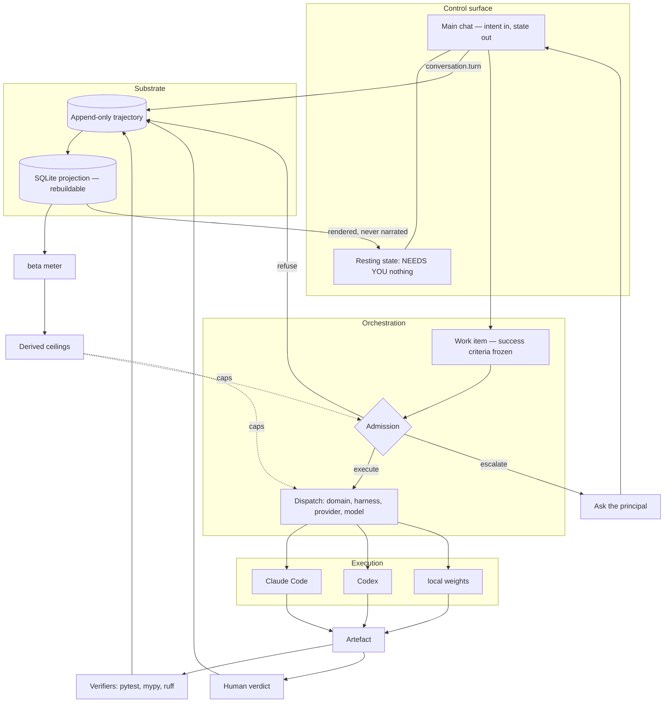
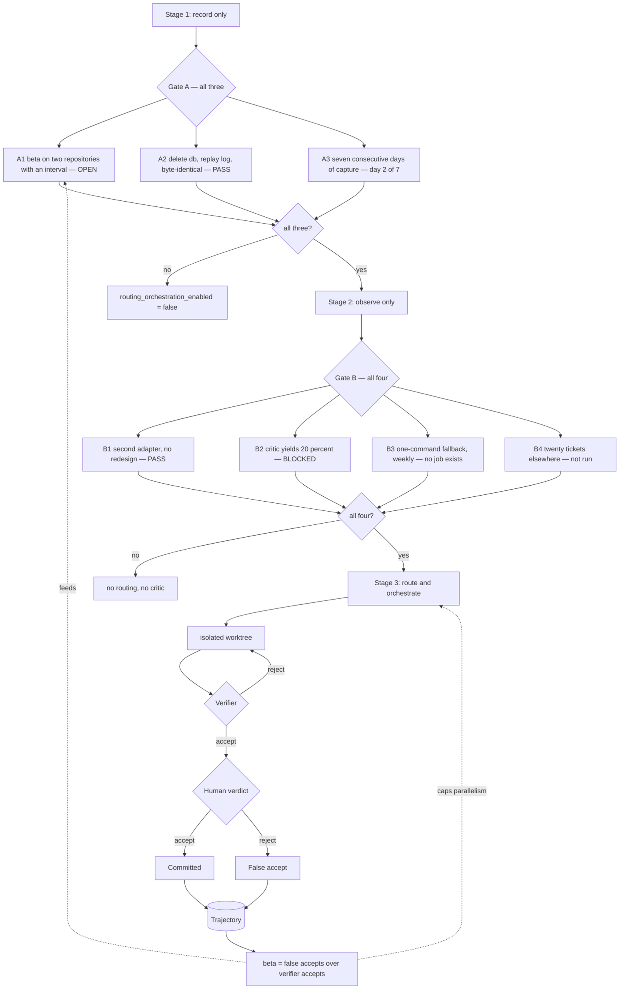
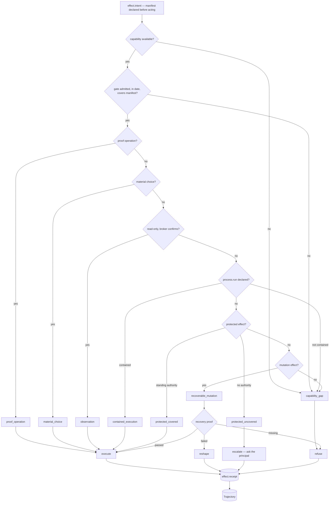

# Documentation architecture and interface surfaces — audit and plan, 23 August 2026

Eight auditors, two designers and an adversarial critic. Commissioned after the principal asked
for the full vision and end-state to be documented for both agents and humans, with diagrams, and
for living documentation that stays in sync with the code.

**The finding that governs the rest:** the anti-drift machinery already existed and was wired into
nothing. `check_generated_documents.py --check` reported `checked=2 adverse=2` and exited 1 while
CI was green, because no workflow called it — both generated documents had drifted. That is this
repository's canonical failure, a chokepoint with no enforcement rule, committed against its own
enforcement machinery. Repaired the same day: both documents regenerated, the check added to
`.github/workflows/invariants.yml`, and a test added that fails on live drift rather than on the
checker's fixtures.

---

# Consilient: end-state, documentation architecture, and build plan

*23 August 2026. Claims carry evidence tags. Counts measured on this tree unless stated.*

---

## The end-state, in one page

You have more work than you can personally check. That is the ceiling. Consilient is built for it.

You say what you want, in your own words, and what would count as done. Consilient takes it from there: it sends the work to whichever agent runtimes you already use — Claude Code, Codex, Cursor — or to a model on your own hardware, keeps one record of everything that happened, and comes back with the result and with the one number nobody else gives you: **how often its own checks are wrong.**

That number matters more than the work. Every agent eventually says *checks passed*. Consilient measures the share of bad work that survives every check it has, on *your* work, and then conditions what it does next on the answer. Where the checks are strong it runs more, unattended, and you read less. Where they are weak it says so and refuses to route, because parallelism on a weak check is a machine for manufacturing work you must review by hand.

Finished, it is an organisation you talk to rather than a tool you operate. Standing agents own areas and keep progressing them. It decides everything reversible itself and records the way back. It stops and asks you in six cases only — money, credentials, anything published outside your machine, anything unrecoverable, your own authority, and genuine matters of taste. If it asks you anything else, that is a defect.

It is MIT licensed and open-source first. Every capability is in the free version, permanently. Paid plans, when they exist, fund storage and hosted inference at minimal margin for people who do not want to run their own.

**What is true today, so this page cannot be read as a status report.** `consil` records, replays and computes β; it cannot route, block or accept anything, and a test asserts that. Dispatch runs as a supervised script on this repository only. The chat is designed, not built. Outside coding, β is undefined — whether anything plays its role for a strategy memo is an open question, not a backlog item. [measured: `consil doctor`, `routing_orchestration_enabled: false`]

---

## What the audit found

**Good, and to be kept unchanged.** `docs/00-context/the-machine-2026-08-22.md` — the principal's verbatim words with measured distance from the code, and roughly 80% of an end-state document already written. `docs/00-context/design-bar-2026-08-23.md` — the correct method for finding a bar, frozen before judging, and it must not be edited. `docs/20-design/frontend-concepts-kimi-2026-08-20.md` §2 — twelve interface refusals, each with a citation or an invariant. `docs/20-design/minimum-user-guide-draft-2026-08-21.md` — the only prose here written for a person, obeying its own rule against jargon. `docs/40-spec/requirements.md` + `requirements-source.json` — generated, hash-pinned, with a provenance warning naming its own fabricated quote. `ADR-0073` and `docs/superpowers/specs/2026-08-22-living-documentation.md` — the classing (generated / written / state projection) and the abolition of hand-maintained prose. [measured]

**Missing, and for whom.** No document states what Consilient is when finished; a newcomer following the repository's own entry path concludes it is an observe-only β-meter. [measured] Zero diagrams across 284 markdown files. [measured] No page addresses a user whose field is not software. Counts on the front page are wrong by a factor of three — README says 34 ADRs and 35 experiments; disk holds 98 and 113. [measured] The contributor path ends in a 404 (`ways-to-contribute.md` → `../CONTRIBUTING.md` → `docs/CONTRIBUTING.md`, absent). [measured]

**The finding that governs everything else.** The anti-drift machinery exists and is unplugged. Running `python .github/scripts/check_generated_documents.py --check` today gives `checked=2 adverse=2`, exit 1 — both generated documents are drifted, and CI is green, because the checker is in no workflow. [measured] The repository committed its canonical failure — a chokepoint with no enforcement rule — against its own enforcement machinery.

---

## Documentation architecture

**One corpus. Split by document class, never by audience.**

The argument is measured, not aesthetic. Two hand-kept locations for one fact produced *two different wrong answers* in the same week: README says 34 ADRs, `CLAUDE.md` says 45, disk holds 98. [measured] An "agent docs" corpus is that failure by construction. `CONTRIBUTING.md` already says `AGENTS.md` "applies to humans as well as agents" — the existing split is normative versus descriptive, and it works. Agents and humans need the same facts at different density. Density is a rendering problem; keeping two corpora consistent is not.

Four classes: **G** generated whole (nobody edits, regenerate); **W** written with a falsifier and a review-by date; **W/g** written prose with generated regions between markers — the shape every diagram-bearing document takes; **S** state projections, never committed as prose.

**The tree.** Only what changes is listed; everything unnamed stays exactly where it is.

```
README.md                 [W]  The door. Fifteen words on what changes for the reader.
AGENTS.md                 [W]  Prohibitions first. Counts deleted.
CLAUDE.md                 [W]  Pointer. Counts deleted.
CONTRIBUTING.md           [W]  + "Your first hour": the four gate commands.
CITATION.cff              [W]  NEW. So the work can be cited.
docs/
  END-STATE.md            [W/g] NEW. Section 1 of this document, expanded. Distance column generated.
  project-facts.md        [G]  NEW. The only home for restatable values.
  index.md                [G]  NEW. Reading map keyed by audience, from front matter.
  05-guide/               NEW. The human surface.
    what-this-is.md       [W]  Five ideas, no jargon by rule. From minimum-user-guide-draft.
    for-your-field.md     [W]  What a non-coding user gets, and what is open.
    first-hour.md         [W]  Moved from 00-context/getting-started.md.
    how-this-is-funded.md [W]  Open-source first; open-core refused.
    ways-to-contribute.md [W]  Moved; broken link fixed.
  00-context/             48 → ~16. Frozen bars, principal statements, open questions only.
  90-record/              NEW. ~32 dated incidents, audits, teardowns, briefings. Frozen.
  diagrams/               NEW. 7 .mmd sources (4 generated, 3 drawn).
  decisions/              98 ADRs. UNTOUCHED — see below.
  10-research/ 20-design/ 40-spec/ 50-publications/ legal/ superpowers/   In place.
```

**The 98 ADRs are not touched.** Not moved, not renamed, not given front matter. Their bold-key header (`**Status:**`, `**Supersedes:**`) is parsed by two working scripts; adding a `Class:` line risks both for nothing. The trail is class W by construction and already carries status, date, supersession and an Evidence-against section. The class check excludes them by rule, with the reason in the check.

**The reader's path.** Seven documents, each with an exit criterion — what the reader can say when they leave.

1. `README.md` — "It sends my work to runtimes I already use, keeps one record, and tells me how often its own checks are wrong."
2. `05-guide/what-this-is.md` — "β is the share of bad work that survives every check. That number decides what can run unattended."
3. `05-guide/for-your-field.md` — "Today I get intent compiled into committed work and an inspectable record. Outside coding, β is undefined and they say so."
4. `05-guide/first-hour.md` — "Installed, and I have seen a real β with its interval on the bundled fixture."
5. `docs/END-STATE.md` — "Here is the finished thing, and the measured distance from it, line by line."
6. `05-guide/ways-to-contribute.md` — "Falsifying one of their ADRs is welcome, not an attack."
7. `CONTRIBUTING.md` — "`pytest tests -q`, `mypy --strict src/consilient`, `ruff check .`, `python scripts/release_check.py`."

Agent side entrance: `AGENTS.md` → `docs/index.md` → the named spec → the ADR it cites.

---

## The anti-drift mechanism

Five checks. Four are new; the strongest already exists and is unwired.

**C0 — `tests/test_living_document_ci.py`. The load-bearing one.** Inspects the literal text of `.github/workflows/invariants.yml`. Fails if any of C1–C4's invocation is absent or reordered.

```
FAIL: documentation gates are not wired.
  Missing: python .github/scripts/check_generated_documents.py --check
  A check that is not invoked is not a check. On 23 Aug 2026 that checker
  reported adverse=2 against this tree while CI was green. Do not delete this test.
```

Every other check is worth exactly what C0 is worth. "Add a CI step" is a human action, and this repository has the measurement proving humans forget.

**C1 — `check_generated_documents.py --check`** (exists; wire it). Inspects each manifest entry's header against the manifest, recomputes the source SHA-256, re-runs the producer. Extended with a `regions` entry type so a W/g document is checked only between its markers. **Fix while wiring:** `source_digest()` hashes whole source bytes, so any ADR body edit trips the decision-index check even when the rendered index is byte-identical — which is exactly what both current failures are. [measured] Narrow the digest to consumed fields, or record the decision to accept regeneration as a pre-commit step.

**C2 — `check_document_class.py`** (new). Requires `Class:` in the first 20 lines of every `.md` under `docs/`, excluding `decisions/[0-9]{4}-*.md` and `90-record/`. Class W additionally requires `Falsifier:` and `Review-by:`. It fails everywhere on day one, so it ships with `docs/.class-backfill`, an allowlist that **may only shrink**: `FAIL docs/.class-backfill grew from 217 to 219 paths. A new document declares its class.` A shrinking file is a mechanism; a warning phase is a wish.

**C3 — `check_restatement.py`** (new). The highest-value check. Inspects every W and W/g document outside generated regions for literal restatements of the values `docs/project-facts.md` declares: ADR count, EXP count, spec count, β with numerator and denominator, gate names and states, version.

```
FAIL docs/05-guide/what-this-is.md:32 restates a generated value "0.3132".
  Every restatement measured here has drifted:
    README.md:146  "34 ADRs, 35 registered experiments"
    CLAUDE.md:13   "45 ADRs and 47 registered experiments"
    on disk:       98 ADRs, 113 registered experiments
  Fix: link docs/project-facts.md#beta, or register a generated region.
```

This one check catches every drift found in this audit round.

**C4 — `check_links.py`** (new). Resolves every relative markdown link. Catches the live 404 at the end of the contributor path. It ships **before** the file migration, not after.

**Three things I will not pretend to check.** Paraphrase drift — a claim reworded until it no longer means the same thing. Fabricated provenance with a well-formed locator; `build_requirements.py` rendered a fabricated quote faithfully with a green check. Motivation drift — the reason for a decision ceasing to hold while the decision stands. `2026-08-22-living-documentation.md` §4 says this already and should be kept verbatim. A green badge is believed more than plain prose, so overclaiming reach here is worse than admitting it.

**Two answers the critic forced.** `END-STATE.md`'s distance column is a **generated region** (C1-checked), not prose — otherwise the flagship document fails C3 on day one and gets exempted, and the exemption is the drift. And `gate-pipeline.mmd` / `command-index.md` are sourced from **runtime** state (`consil doctor --json`, `--help`), which `source_digest()` cannot hash: they are class **S** — regenerated on demand, carrying `as of <timestamp>`, checked for freshness rather than for hash equality.

---

## The diagram set

Seven Mermaid sources. No Lucid: the largest graph here is 26 modules, all lay out legibly, Lucid output cannot be diffed or regenerated, and requiring a commercial seat to fix a diagram is a contribution barrier this project has no reason to accept. Figma only when pixel fidelity is the deliverable, and not until a surface is being built.

| Diagram | Tool | Source | Audience | What a reader learns |
|---|---|---|---|---|
| system-architecture | mermaid, drawn | — | all | Two centres in one system: chat is control, record is substrate |
| gate-pipeline | mermaid, generated (S) | ADR-0015 + `doctor --json` | all | Why routing is off, and the loop by which β gates itself |
| permission-model | mermaid, generated | `effects.py` | principal | What runs without asking, and what must ask |
| event-flow | mermaid, generated | `events.py` | agent | Where a new event kind belongs |
| data-model | mermaid, generated | `projection.SCHEMA` | researcher | How to reproduce a β measurement |
| module-dependency | mermaid, generated | `ast` over `src/` | contributor | Where the god-nodes are |
| adr-lineage | mermaid, generated | ADR headers, supersession subgraph only | researcher | Which decisions still govern |

Generation is not tidiness. Drafting the permission model by hand from ADR-0033 put `material_choice` on the escalate path; `_disposition_for` (`src/consilient/effects.py:424-440`) executes it. [measured] Generation surfaced a live contradiction between the safety model as documented and as implemented. That contradiction needs its own investigation.

### 1. System architecture (drawn)



### 2. Gate pipeline (generated)



### 3. Permission model (generated from `effects.py`)



The `material_choice → execute` edge is drawn because that is what the code does, and it contradicts ADR-0033 §2. [measured]

---

## The interface surfaces

One window, one always-focused input, and lenses that open beside it. A lens is a saved query over the record plus a keyboard; it holds no state and closing it loses nothing.

| Surface | Job | Typed equivalent |
|---|---|---|
| Chat | Compile a sentence into a committed work item; render state back | *(it is the shell)* |
| First run | Install to one real β on a bundled fixture, no account | `"show me what beta means"` |
| Ask | Spend attention once, on the six protected classes | `"what needs me"` · `"accept 118"` · `"authorise £8.40 on 131"` |
| Record | Scrub the trajectory at four depths | `"show me the record for yesterday afternoon"` |
| Work item | One stream, its frozen success contract, its verifier | `"what's happening with 121"` |
| Run | What one agent is acting on; steer it on the record | `"jump into the run on 121"` · `"stop 121"` |
| Organisation | Standing remits and per-item RACI as two objects | `"who owns growth"` · `"who is consulted on 121"` |
| Loops | Every always-on loop: frequency, model, cost, last artefact | `"what's running on its own"` · `"turn off the archive loop"` |
| Spend | Money and quota per provider, with resets and provenance | `"what am I spending"` · `"cap me at £50 a month"` |
| Checks | β with n and interval; gate state; no composite score | `"what is beta and what is n"` |
| Memory | What is durably remembered, and forgetting | `"what do you remember about the migration"` |
| Connections | Tools, MCP, skills, grants; never credential values | `"why can't you read my email"` |
| Settings | What was decided, by whom, and how to undo it | `"stop asking me about spend under £5"` |

Every typed form names its referent, because chat has no selection. `"go deeper on that"` is not in the list; `"go deeper on 121"` is.

**Settings without overwhelm.** The incumbent to beat is VS Code's settings editor: search over descriptions rather than keys, `@modified` as the real navigation, and one schema behind both the UI and the JSON file. It is beaten on one axis only. Here, every default is a recorded `decision.autonomous` carrying reasoning and an executable reversal (ADR-0033 §1), so the resting surface shows **what has actually been decided about you** — typically two or three rows, each with its why and its undo — instead of everything that could be decided. Tier two is `@modified`; tier three is the full schema, reached by search, never by a category tree. Each row prints the sentence that replaces it, so the window teaches the chat command. "Not overwhelming" gets three CI-checkable budgets in `DESIGN.md`: ≤12 rows at rest, ≤1 attention colour per region, ≤2 actions to reach any setting.

---

## Chat and record, reconciled

**What the prior design pass got right.** Kimi §1 is correct that the trajectory is the single perpetual thing and every surface is a lossy, rebuildable projection of it. R2–R12 are correct and survive verbatim: no streaming theatre, no reasoning panels, no confidence scores, no composite health index, no thumbs, no personas, no spinners as liveness, no unattested remote verdicts. Each carries a citation or an invariant, and none was ever about whether a text input exists.

**What the principal got right.** A conversation with the orchestrator is the one genuinely exogenous class of facts the system cannot manufacture for itself. Kimi's echo argument applies Whewell's clause about convergent evidence between *verifiers* to a human typing a sentence, which is a category error.

**R1 loses.** Its unbounded-structure objection applies equally to `.harness/log`, which the same section celebrates.

**And now the sentence the diplomatic version omits: main chat as the principal means it is refused.** No scrollback that remembers, no accumulating thread, no streamed thinking, no conversational memory. What is being built is a command line with a message column and a state line above it. A user who scrolls up to answer "what is β?" has proved the design failed. That is a real refusal of a real instruction, and calling it a reconciliation without saying so would be the failure this project is named against.

**What is genuinely unresolved.** Kimi §3 and design-bar §7 independently concluded the resting surface should be a trajectory instrument, not a transcript. That convergence is being overridden by authority, and the falsifier — design-bar §7's own killing check, N≥10 on a frozen fixture — has not been run. Until it is, this is an open disagreement labelled with a decision, which is the weakest state in this document.

---

## The business model, as end-state

**Documented, not built. No paid code exists and none will before the open-source release.**

Free forever and open source first. Every capability is in the MIT version, usable by someone who pays nothing and contacts no server we operate. Open-core is permanently refused (ADR-0024 §1). Bring your own model — local weights or your own API keys — gets full value, with no degraded route, and that is a check, not a promise.

Paid plans fund maintenance, hosted record storage, and hosted inference, at minimal margin, **prepaid, never in arrears** (ADR-0048, ACCEPTED). Prepaid because billing in arrears requires attribution to work perfectly and billing in advance does not — and this project has already measured its metered composition failing. [measured] Every implied number is a placeholder; nothing has been costed. Comparables priced: Ghost, $11,055,673 ARR over 30,557 customers, non-profit; Nabu Casa $6.50/month; OpenRouter, no markup on inference, 5.5% on credit purchase, BYOK free to $25,000/month. [cited, retrieved 2026-08-23]

**Far future: cloud cost-piping**, where a non-technical user never opens a cloud console. Preconditions: all cloud configuration autonomous barring auth and financial decisions, verified by a pre-registered experiment (N consecutive end-to-end provisionings by non-technical testers, zero console visits), and a solicitor's answers on reseller tax treatment, VAT place-of-supply, e-money status of prepaid balances, Article 28 processor terms, and whether upstream providers permit resale at all.

**The risk, stated plainly, and it is close to fatal.** The precondition dissolves the rationale. If configuration is autonomous, the free local install does it into the user's own account. What remains sellable is only *not needing a cloud account*, which is the pure reseller position with every liability attached and none of the technical work. There is no middle version. Design nothing for this now.

---

## Build units

1. **Wire the gates.** *Deliverable:* C1 step in `invariants.yml`; `tests/test_living_document_ci.py`; both drifted documents regenerated. *Done when:* `check_generated_documents.py --check` exits 0, and deleting the CI step makes `pytest` fail. *Depends on:* nothing.
2. **Narrow the source digest.** *Deliverable:* `source_digest()` scoped to projection-consumed fields, or an ADR accepting regeneration as a pre-commit step. *Done when:* editing an ADR body does not trip the decision-index check unless the rendered index changes. *Depends on:* 1.
3. **Fact spine.** *Deliverable:* `scripts/build_project_facts.py` → `docs/project-facts.md`, manifest-registered. *Done when:* it appears in the manifest and C1 passes; counts match disk. *Depends on:* 1.
4. **Restatement lint.** *Deliverable:* `check_restatement.py` + CI step; counts deleted from `README.md:146` and `CLAUDE.md:13`. *Done when:* reinserting "34 ADRs" fails CI; a link passes. *Depends on:* 3.
5. **END-STATE.md.** *Deliverable:* section 1 of this document expanded, with the distance column as a C1-checked generated region. *Done when:* it is item 1 of README's Start here, is linked from `AGENTS.md`, and C3 reports no restatement. *Depends on:* 3, 4.
6. **ADR-0097 and DESIGN.md.** *Deliverable:* ADR-0097 (chat is the control surface, the record is the substrate), including the refusal stated in §"Chat and record"; supersession clauses in `DESIGN.md` §§1/7/9 and ADR-0060 §6; dated successor bar with test 4 restated. `design-bar-2026-08-23.md` is not edited. *Done when:* no live document instructs an agent to refuse a chat surface. *Depends on:* 5.
7. **Link check, then migrate.** *Deliverable:* `check_links.py` + CI; `00-context` split into `00-context/`, `90-record/`, `05-guide/`; `docs/publications/` merged into `docs/50-publications/`. *Done when:* C4 exits 0 and the `ways-to-contribute` 404 is gone. *Depends on:* 1.
8. **Class the corpus.** *Deliverable:* `check_document_class.py` + `docs/.class-backfill`; entry path and 29 specs backfilled. *Done when:* the backfill list shrinks in every subsequent PR. *Depends on:* 7.
9. **Human entry path.** *Deliverable:* `README.md` rewritten to ~80 lines; `05-guide/{what-this-is, for-your-field, first-hour, how-this-is-funded}.md`; `CITATION.cff`; `CONTRIBUTING.md` first-hour section; `docs/index.md` generated. *Done when:* C3 and C4 pass on all of them and each carries a review-by date. *Depends on:* 4, 7.
10. **First-run demo.** *Deliverable:* bundled synthetic trajectory and `consil beta --demo`, labelled synthetic, never mixed into a real log. *Done when:* a clean clone prints a real β with its interval in under a minute. *Depends on:* 3.
11. **Diagram generator.** *Deliverable:* `scripts/build_diagrams.py`, the `regions` manifest type, and four generated diagrams. *Done when:* editing `effects.py` without regenerating fails CI. *Depends on:* 1, 2.
12. **Drawn diagrams.** *Deliverable:* `system-architecture.mmd`, plus `gate-pipeline` as class S. *Done when:* embedded in `END-STATE.md` and `architecture-sketch.md`. *Depends on:* 6, 11.
13. **Orphan checkers.** *Deliverable:* `check_record_numbers.py` and `check_adr_experiments.py` wired or deleted with a reason; a test asserting every `check_*.py` has a caller. *Done when:* that test passes. *Depends on:* 1.
14. **`material_choice` investigation.** *Deliverable:* either the escalation path found elsewhere, or an ADR recording the hole and its fix. *Done when:* the generated permission diagram and ADR-0033 §2 agree. *Depends on:* 11.

Units 1–5 are hours, not days, and they are what make 6–14 durable.

---

## What we did not resolve

**The audit is echo, and section 7 of the prior design document was wrong to call the agreement evidence.** Six auditors, one base model, one repository, one brief that named the conflict and asked them to resolve it. They agreed. By CONSILIENCE.md's own test — a different class of facts, or it is echo — that is solicited echo promoted to evidence. Every claim here inherits that discount. The exogenous checks that would fix it are a non-Claude reviewer, and a user who has never seen the repository.

**Nobody asked whether anyone wants this.** Zero users, zero demand evidence, and a week spent on documentation architecture for an observe-only CLI. The documentation-to-shipped-capability ratio is itself a finding, and this plan adds 12 files to it.

**β's construct validity is unexamined.** 0.3132 on seeded mutants of one suite may measure that suite's coverage rather than a property of the work. Six audits argued the denominator; none asked the question.

**Chat parity is not what the write-parity check measures.** Eleven of twelve lenses are valuable for *reading*, and a check that compares reachable mutations will pass while chat-only users get nothing — and then be cited as proof they do not. Diff review is the sharp case: the Ask's real action is opening your editor, and `"accept 118"` without seeing the diff is the rubber-stamp that raises β.

**Frozen documents are now unchecked.** `90-record/` holds ~32 files full of β figures and gate states, exempt from C3 and review-by. That is a sanctioned second source of truth, mitigated only by the directory name.

**Diagram captions are unprotected.** W/g checks the fence; the sentence explaining it is prose about a generated artefact, and nothing catches it going stale.

**Q24 remains open** — whether anything plays β's role where no automated oracle exists. `for-your-field.md` states it as open, and when it closes that page becomes wrong with no falsifier firing.

---

## Adversarial critic

## 1. Where it drifts

- **`END-STATE.md` is the drift bomb.** Its selling point is a "measured-distance column for every capability" — gate state, β, requirement tallies. That is precisely what C3 forbids in class-W prose. The plan never says whether the column is a generated region, so either the flagship document fails the lint on day one or it gets exempted, and the exemption is the drift.
- **§3's exit-criteria table restates β in prose** ("about one in three"). The plan's own showcase table would fail its own check.
- **`gate-pipeline.mmd` and `command-index.md` are "generated" from runtime state**, not source bytes — `consil doctor --json`, `--help` on installed scripts. `source_digest()` hashes files. These entries have no valid source hash: they either fail CI on every gate tick or are excluded and silently stale. The manifest's whole model assumes file sources; two of eight new entries break it.
- **Diagram captions.** W/g protects the fence; the sentence under it explaining what the diagram means is unprotected prose about a generated artefact. Regenerate `permission-model.mmd` after an `effects.py` change and the caption still describes the old model. That's where meaning lives and nothing checks it.
- **`90-record/` is exempted from restatement and review-by** — ~32 files full of β figures, ADR counts and gate states, frozen, greppable, and now officially unchecked. You built a sanctioned second source of truth and called it an archive.
- **`for-your-field.md` hard-codes "Q24 is open."** When Q24 closes, the recruiting page is a lie and no falsifier fires.

## 2. Not chat-drivable

- **Deixis.** `"go deeper on that"`, `"jump into that run"`, `"approve that composition"` — every one requires a referent the chat doesn't have. The design assumes a selection, and selection is clicking.
- **Diff review.** The Ask's real action is `o` → your editor. There is no chat rendering of a diff. `"accept 118"` without seeing it is the rubber-stamp that raises β — the product's central failure mode sitting inside its central surface.
- **The scrub.** Surface 2's value is continuous comparison across time. `"show me 14:00–15:00"` is a query, not a scrub.
- **The write-parity check is the wrong check.** Mutations are trivially chat-reachable; the value of eleven of twelve lenses is *reading*. Parity on writes will pass while chat-only users get nothing, and the passing check will be cited as proof they do.
- **Figma prototypes** are unreachable from chat by definition. "Full value from chat" is already false for the principal's own design review.

## 3. Cut

- `one-day-with-consilient.md` — fiction whose steps are mostly marked "does not exist"; rewritten every sprint, read once.
- `glossary.md` — needing one means the prose failed. Fix the prose.
- `prose-bar-2026-08-23.md` — a bar document to write an 80-line README.
- `components.md`, `interaction-spec.md`, `tokens/*.json`, Figma library — four design artefacts for **zero built surfaces**.
- Six of nine hand-drawn diagrams (`consilience-test`, `deployment-topology`, `user-journey`, `loop-taxonomy`, `standing-remits`, `raci-rights`) — already prose, and drawing them commits you to maintaining them.
- **31 new files** into a repo whose stated diagnosis is "283 files that compose into nothing." The plan's cure is the disease with better front matter.

## 4. Echo, not evidence

- Six auditors, one base model, one repository, one brief that *named the conflict and asked them to resolve it*. They agreed. §7 cites that agreement as "a consilience result." By CONSILIENCE.md's own test — different class of facts or it's echo — this is textbook echo, solicited, and then promoted to evidence. That is the single worst moment in the document.
- **Nobody asked whether anyone wants this.** Zero users, zero demand evidence, and a week spent on documentation architecture.
- **Nobody questioned β's construct validity.** 0.3132 on seeded mutants of one suite measures that suite's coverage. Six audits argued the denominator; none asked whether β is a property of the work or of pytest.
- **All six accepted "documentation is the bottleneck."** An outsider sees an observe-only CLI, 286 documents, and a documentation-to-shipped-capability ratio that is itself the finding.

## 5. Split the difference

- Yes. "R1 loses" is a word; R1's substance survives intact — no scrollback, no memory, no streaming, resting state is Kimi's instrument panel. Kimi lost the label and kept the design; the principal asked for a chat and got a command line with a message column.
- Nobody was told they were wrong. The honest sentence — *"main chat, always, as you mean it, is refused"* — is never written.
- The falsifier is deferred to a test not yet run. An unresolved disagreement labelled resolved is worse than an open one.
