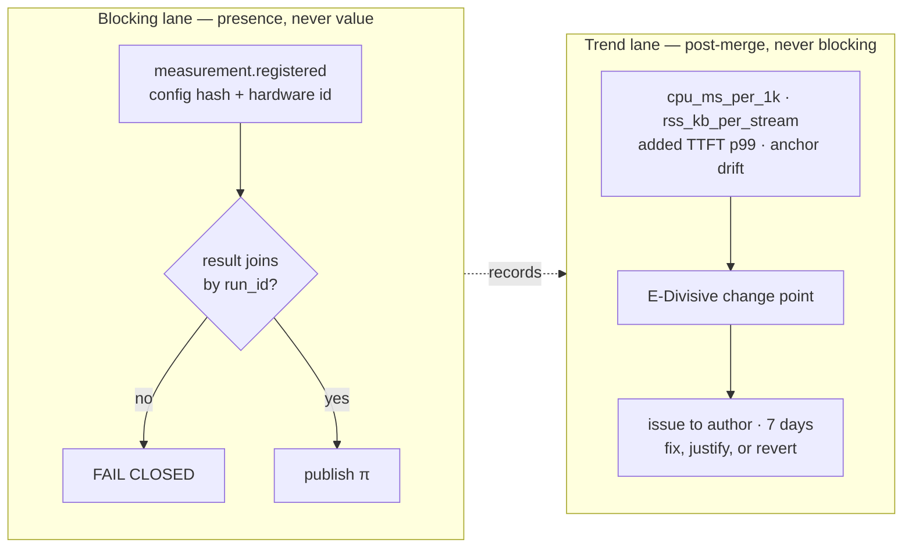

# Measurement and efficiency architecture, 23 August 2026

Eleven agents. Commissioned after the principal asked for performance tests that say *how good*
something is rather than yes or no, and for the system to stay efficient while driving hundreds of
models on ordinary hardware.

**The finding that reshapes the request.** Detecting a small improvement between two close
approaches needs roughly **8,700 clustered task instances** for one credible comparison. This
project will never run that. So the instrument is inverted: **detect worse, do not rank better.**
A large regression is a far easier signal than a small improvement, and it is also the expensive
mistake.

**Why self-report is inadmissible at any sample size.** In METR's randomised trial, AI *increased*
completion time by 19% while the same developers estimated 20% faster, economists 39% faster and
ML experts 38% faster (arXiv:2507.09089). Every population that could have caught it got the sign
wrong.

Elo and Bradley-Terry are refused because whoever controls the comparison pool controls the score.
Item response theory is refused because agent tasks in one repository violate its local
independence assumption, and the precision floor it would gate on is the quantity that violation
fakes. What ships is a paired difference on a fixed task set with a cluster-robust interval, an
anchor set that is never published, and a deliberately dumb single-model baseline in every
comparison.

Three things get built; eleven are refused by name.

---

# Measurement and Efficiency Architecture

**Status:** proposed. British English. Every claim tagged `[measured]` `[cited]` `[simulated]` `[algebra]` `[asserted]`. Nothing here gates until its build unit ships with its enforcement rule (working principle 3).

---

## What is being asked

Two things, and they are not the same instrument.

**Quality.** Grade approaches — to code, architecture, learning, research — on a continuous scale with an interval, so "better than best" is a number rather than an assertion. β already has this shape: a point, a Wilson interval, a sample floor of 30 rejections, and a refusal verdict below it `[measured, src/consilient/beta.py:38,123]`. The quality instrument must inherit that discipline, including the refusal.

**Efficiency.** TTFT, inter-token latency, throughput, on ordinary hardware, while driving tens to hundreds of models.

The honest framing, before anything else: **β currently has zero rows** `[measured, beta.py docstring]`, and `adopted-deps.json` records zero adopted dependencies `[measured]`. Any architecture that requires nine new instruments before it produces a number will produce nothing. This design therefore builds three things and refuses to build eleven.

---

## The quality instrument

**Statistical model: paired difference of proportions on a fixed task set, with a cluster-robust bootstrap interval.** Not Elo, not Bradley–Terry, not Item Response Theory.

Why not the fancier options, in order of temptation:

- **Elo/BT** measures a model relative to a *pool*, and whoever controls pool composition controls the score — Meta tested 27 private Llama-4 variants pre-release; Google and OpenAI drew ~19.2% and ~20.4% of all Arena data against 29.7% shared by 83 open-weight models `[cited, arXiv:2504.20879]`. Elo additionally violates reliability and transitivity in measured LLM use `[cited, arXiv:2311.17295]`.
- **IRT/θ** buys nothing over a pass rate on a fixed item set — detection power for a 0.3-logit gap was 0.235 for both estimators at n=200 `[simulated, Rasch, 4,000 trials, seed 20260823]`. It buys everything on a *drifting* set (+8.9 pass-rate points of fictitious improvement versus +0.004 logits anchored) `[simulated]` — but it assumes local independence, which agent tasks in one repository violate, inflating information and shrinking SE by ≥3× `[cited, arXiv:2411.00640]`. A precision floor (`MAX_SE ≤ 0.3 logits`) is gated on exactly the quantity the known bias fakes `[asserted]`. Refused.

**What ships instead.** Miller's recommendation 4: compare two approaches on the *same* task instances and test the paired difference, which is strictly more powerful than comparing independent rates and costs one function `[cited, arXiv:2411.00640]`. Bootstrap the interval clustered by repository from the first run, not after someone notices.

**Comparability across time — stated plainly: it is not comparable, unless anchored.** A frozen anchor set of ~100 tasks per family, never published, never in a prompt or a repository the agent can read, re-run every period `[cited, design from arXiv:2604.12843]`. Report anchor pass rate beside full-bank score. When the two diverge, the *bank* moved. That is drift detection with no IRT fit at all, and it is about a week of work `[asserted]`.

The reported object mirrors `Beta`: `verdict ∈ {measured, insufficient_data}`, point, interval, n, cluster count, `anchor_set_hash`, `measured_at`, `drift` as a signed quantity with its own interval. It opens at `insufficient_data` and stays there until the anchor set has been run twice `[asserted]`.

**Anchor integrity is a security property, not a statistical one.** Hashing proves the set did not change; it proves nothing about who has read it. A leaked anchor set raises the score with no capability change and the drift statistic will not flinch, because the anchors *are* the reference `[asserted]`.

---

## Which evals to adopt

| Harness | Measures | Licence | Cost | Graded? | Verdict |
|---|---|---|---|---|---|
| **Inspect AI** (UK AISI) | arbitrary agents via `sandbox_agent_bridge()`; every scorer reports `stderr` beside `accuracy` | MIT `[cited]` | API tokens only | graded | **Adopt, after BU3** |
| **SWE-bench-Live** (MSR) | 50 new verified issues/month; `lite`/`verified` frozen | MIT `[cited]` | Docker, hours | binary per task | **Adopt as held-out** |
| **LiveCodeBench** | date-annotated problems, scoreable post-cutoff | MIT `[cited]` | low | binary | **Adopt the `release_date` mechanism**, not necessarily the set |
| **lm-evaluation-harness** | `pooled_sample_stderr`, `combined_sample_stderr` | MIT `[cited]` | n/a | graded | **Read the file before writing an aggregation.** Do not adopt the runner |
| **vLLM `bench serve`** / **GenAI-Perf** | ttft/tpot/itl/e2el, goodput under SLO | Apache-2.0 / BSD-3 `[cited]` | free | graded | **Adopt the vocabulary**, see Efficiency |
| **OpenAI Evals** | model-graded via YAML | MIT `[cited]` | — | — | **Refuse.** Second scoring vocabulary, no gain |
| **orjson** | 3.0× parse | MPL-2.0 in the expression `[measured, importlib.metadata]` | — | — | **Refused by our own licence gate.** Use `msgspec` (BSD-3, 3.67×) if ever needed `[measured]` |

**Genuinely must be built — three things, and only three:**

1. The **orchestrator overhead meter** (§Efficiency). No published harness measures the client; MLPerf, vLLM and GenAI-Perf all measure the server `[cited]`.
2. The **pre-registration event**. ~20 lines against the existing append/replay path, worthless retroactively `[asserted]`.
3. The **anchor set** — a JSON file and a hash `[asserted]`.

**Do not build:** a benchmark harness, a scoring vocabulary, an Elo ladder, an IRT fitter, a replay corpus (§Open questions).

---

## Benchmarking an approach

**The honest sample size, computed rather than asserted.** Miller: ~969 questions to detect a 3-percentage-point absolute difference at 80% power, α=0.05 `[cited]`. Clustered SEs measured >3× naive `[cited]` → variance ×9 → **~8,700 clustered task instances for one credible comparison of close approaches** `[algebra]`. Independently: a genuine 5.3-point gap was detected 23.5% of the time at n=200 `[simulated]`.

**That is unreachable.** This project will not run 8,700 instances of anything. Any design premised on ranking close approaches is a design that will never conclude.

**So the instrument's job is inverted: detect *worse*, not rank *better*.** A large regression is a much easier signal than a small improvement, and it is the expensive mistake. Concretely:

- **Crossover, within-task, counterbalanced.** Same task under A and B, order randomised, ≥3 seeds per cell, fixed token and wall-clock budget so no approach wins by spending more `[cited, AMLB design, arXiv:2207.12560]`. Carryover is real and one operator cannot counterbalance it away `[cited, DOI 10.1109/tse.2015.2467378]`.
- **A deliberately dumb baseline in every comparison** — one model, no orchestration, same budget. Random search with early stopping matched a leading NAS method once the dumb arm was run properly `[cited, arXiv:1902.07638]`.
- **Anytime-valid confidence sequence** on the running estimate (betting-based, bounded outcomes — β is bounded) so the number can be read after every task without α inflation, and evidence accumulates across months instead of resetting `[cited, Waudby-Smith & Ramdas]`.
- **A pre-registered killing experiment** per claim, per working principle 11.

**Self-report is inadmissible at any n.** METR's RCT: AI *increased* completion time by 19% while the same developers estimated 20% faster, economists 39% faster, ML experts 38% faster `[cited, arXiv:2507.09089]`. Every population that could have caught it got the sign wrong.

**The recurring cost is a doubling of compute on every approach change.** That is the price of the whole thing and it belongs in the spec.

---

## Efficiency: the targets

The critical separation. Roughly three of fifteen candidate metrics are ours.

| Metric | Percentile | Concurrency | Ours or weather? |
|---|---|---|---|
| **Absolute TTFT** | p50/p95/p99 | swept | **Weather (~20% ours).** Headline 79% reduction on a 100k cached prefix is Anthropic's KV cache, measured by Anthropic, on Anthropic's hardware `[cited]` |
| **Added TTFT** (routed − direct, same endpoint, same minute) | p99 | 1/10/100 | **Ours.** Connection reuse, pool sizing, prefix stability, admission control |
| **Inter-token latency** | — | — | **Not ours, and not even theirs.** vLLM appends `timestamp - most_recent_timestamp` *per SSE chunk* `[cited, read source]`. Tokens-per-chunk is a provider framing choice. Cross-provider ITL is meaningless; within-provider it tracks their deploy schedule. **Report only as a within-provider regression, never as a claim** |
| **Throughput** | — | — | **The account.** Anthropic Start tier 400,000 OTPM = 6,667 tok/s `[cited + algebra]` against 71,487 tok/s measured client capacity `[measured, single run, one machine]` → **~90% of headroom unreachable**. Every throughput figure is a rate-limit reading with a graph on it |
| **`cpu_ms_per_1k_tokens`** | fixed N | 512 | **Ours.** 19.9 plaintext / 35.4 TLS at N=400 `[measured, single run]` |
| **`rss_kb_per_stream`** | peak in flight | 512 | **Ours.** 72.2 raw asyncio vs 94.9 httpx `[measured, single run]` |
| **`ui_thread_max_stall_ms`** | max | 512 | **Ours.** 0.71 ms on an OS thread vs 65.6 ms on the fan-out loop `[measured, single run]` |

**Percentile discipline is adopted, not invented:** MLPerf binds constraints at p99, never a mean — Llama2-70B-interactive 450 ms TTFT / 40 ms TPOT `[cited, mlperf.conf, 23 Aug 2026]`. A mean TTFT is the fast path by construction.

**Load must be open-loop.** The orchestrator is inherently closed-loop; a stall suppresses the samples that would record it — HdrHistogram's worked example shows a 100 s pause reporting "~99.99% of results at 1 msec or below" `[cited]`. Poisson arrivals or expected-interval correction.

**Caches cleared between measured queries, and recorded as cleared** — MLPerf prohibits caching queries, responses, intermediate results and activation-derived values `[cited]`. Prefix caching is the easiest way to produce an honest-looking TTFT no user will ever see `[asserted]`.

**Publish the three client-owned numbers. Label the rest weather, on the dashboard, not in a footnote.**

---

## Client architecture

Single asyncio event loop, in its own process, `httpx` behind a one-function `open_stream(url) -> AsyncIterator[bytes]` seam, stdlib `json`. All in `src/consilient_connectors/`, which already performs network I/O and sits outside the tier-1 AST lock `[measured, outbound.py]` — **so no capability-lock change and no ADR to relax it.**

Numbers that must hold, per concurrent stream, at N=512 on reference hardware, divided by an in-job calibration factor:

- `rss_kb_per_stream` ≤ 96 (measured 72.2 raw / 94.9 httpx) `[measured, single run]`
- `cpu_ms_per_1k_tokens` ≤ 25 (measured 19.1–38.9 by stack) `[measured, single run]`
- `ui_thread_max_stall_ms` ≤ 5 (measured 0.71 against a 0.72 idle floor) `[measured, single run]`
- `queue_growth_mb` = 0 (unbounded grew 48.1 MB in 5 s; `maxsize=1000` grew 0.0) `[measured]`

Four non-negotiables, each with its measurement:

1. **Fan-out never shares the UI's event loop.** Loop stalls to 65.6 ms while an OS thread in the same process stays at 0.71 ms `[measured]`. Topology, not tuning — unfixable later.
2. **Every queue bounded, with an explicit full-policy.** One constructor argument between surviving a slow consumer and eating the machine `[measured]`.
3. **Explicit pool limits, pre-warmed.** httpx defaults 100 connections / 20 keepalive / 5 s `[cited]` — below target concurrency, so requests queue in the pool and surface as inflated TTFT rather than an error.
4. **Read coalescing.** Identical parse work costs 3.05 ms CPU/1k tokens batched and 19–24 ms arriving one frame at a time — a 7× gap that is wakeups, not JSON `[measured]`. Every parser optimisation targets a fifth of the bill.

Threads are refused: 1.0× scaling on 16 cores, 1.83× the memory `[measured]`. Processes scale 8.0× on the same work `[measured]` — shard at ~200 streams per process when the CPU number actually trips, not before.

---

## Device tiers

A tier is defined by two *measured* quantities from a calibration run, not a spec sheet — core count is irrelevant, since a client pinned to 2 of 32 logical cores matched unpinned at every fan-out `[measured]`.

| Tier | Cloud fan-out | Agent subprocs | Local inference | Off |
|---|---|---|---|---|
| **T0 Surface** (phone/tablet) | 0 | 0 | none | everything but observe/approve/interrupt |
| **T1 Constrained** (≤8 GB) | 8 | 2 | refused above ~4B | ambient loops, parallel worktrees, local critics |
| **T2 Standard** (16 GB, 8–12 GB VRAM) | 32 | 4 | 1 model @ 8B Q4 | ambient on idle only, hard deadline |
| **T3 Workstation** (32 GB+, 24 GB+ VRAM) | min(account, device) ≈ 133 @ Start tier `[algebra]` | 8 | 2 concurrent max | — |

The T1 ceiling is set by **agent subprocess memory**, not sockets: a live census showed `claude` 12 processes / 3,162 MB, `codex` 2 / 948 MB, `node` 113 / 10,263 MB — ~14.4 GB committed for tooling alone `[measured, one loaded workstation]`. The stream layer would hold 2,000 streams on the same two cores `[measured]`.

**Local concurrency is capped at 2 because it is a queue.** Aggregate throughput flat at 194–201 tok/s from concurrency 4 to 16 while median TTFT rose 164 → 3,044 ms and ITL stayed pinned at 4.6 ms `[measured]` — the tell that requests are serialised, not batched.

**Degradation differs by loop type:**

- **Interactive** — reduce fan-out, never queue. But fewer independent evidence classes *is* a β change, so the reduction is a number in the artefact, not a banner `[asserted]`.
- **Verification** — queue, never reduce. Cutting fan-out here raises β directly. If the queue breaches its deadline, **refuse and say the gate could not be evaluated.** An unevaluated gate must never render as a pass `[asserted]`.
- **Ambient** — defer; kill, do not throttle, when the user returns.
- **Local inference** — refuse. Partial GPU offload is a 5–30× cliff `[cited, ADR-0005]`. There is no gradient to be graceful along.

**What the user is told:** one line on every run header — `tier: T2 · fan-out 32/32 · local qwen3:8b 215 tok/s · calib 2026-08-23 run 7f3a` — plus a `tier.degraded` event naming requested versus granted, reusing the existing `dispatch.refused` machinery `[measured, local_fit.py]`.

---

## The gates



**Blocking, pre-merge — exactly three, none of them a performance value:**

1. **`measurement.recorded`** — the run happened and was appended with its config hash and hardware identity. A binary about *recording*, not speed. It cannot be passed by fanning out to fewer models, which is why it is the only gate with teeth.
2. **Registration join** — a result whose `run_id` has no prior `measurement.registered` fails closed, mirroring β's `attempt.outcome`/`attempt.verdict` pattern `[measured, beta.py]`.
3. **Existing checks** — `check_adopted_deps.py`, licence allowlist, tier-1 AST lock. Already working; MPL-2.0 was caught by them `[measured]`.

**Trend only, post-merge, on the dedicated rig, serialised, never a merge blocker:** every efficiency number, every quality number, anchor drift. Detection by E-Divisive change point over the commit series `[cited, arXiv:2003.00584]`, with the per-metric floor learned as `Q3 + 1.5·IQR` from that metric's own history `[cited, rustc-perf]` — never a global percentage. A naive 5% threshold on a blocked comparison false-alarmed on 60% of comparisons where *nothing changed* `[measured, n=30]`.

**Wall-clock may block a merge in exactly one case: catastrophe.** Paired duet estimator, K ≥ 51, threshold +25%. α measured 0.033 at 3% `[measured, n=30 — so "0.000" means fewer than 1 in 30, not zero]`.

**Failure message — required fields:**

```
GATE FAILED  measurement.recorded / fixture:fanout-8-models
  no measurement event for commit e4f5g6h
  this gate is about RECORDING, not speed — a faster run does not pass it
  reproduce:  python -m consil.perf run --fixture fanout-8-models
  accept:     python scripts/accept_perf_baseline.py <metric> <fixture> \
                  --adr 0098 --reason "batch endpoint replaces per-model calls"
  lifetime drift: 8 -> 11 = 1.38x of origin (ceiling 2.0x; ADR required above 1.5x)
```

**Accepting a deliberate regression without eroding the ratchet — three mechanisms, the third is the one that matters:**

1. Baselines rise only via `accept_perf_baseline.py --adr NNNN --reason`; the check fails if the ADR does not exist, reusing `check_adr_trail.py`'s lookup `[measured, script exists]`.
2. Every raise appends to a `history` array with commit, date, ADR, old→new. Nothing is overwritten.
3. **Budget the erosion itself.** An `origin` value that is never edited; the check computes `current/origin` and fails above 1.5× without a fresh ADR, 2.0× principal-only. Death by a thousand 5% concessions is the actual failure mode; the only defence is making the *sum* of concessions a first-class number that needs a signature.

---

## What we refuse to measure

Each is a refusal to **gate**, never to **record**. The quantity is still logged; it cannot bind a decision.

1. **β against a threshold.** β's value is set by the sampling protocol, and the party choosing the protocol is the party the number judges. The shortest path to a good β is to sample human review only from artefacts the checks already accepted — which the docstring already admits destroys the estimate `[measured, beta.py:80]`. There is no check downstream of β to catch it. Report β with its interval and its protocol; let it inform, never bind.
2. **`provider_requests`, or any count of model calls.** Fan out to 3 instead of 8; fold three critics into one prompt; cache a verdict across siblings. All three cut the number; all three cut the count of independent evidence classes, which *is* echo `[asserted]`. Gating this installs an incentive against the project's thesis.
3. **Cost per task.** Same mechanism, same direction `[asserted]`.
4. **Latency, at merge time.** MLPerf reached this under adversarial commercial pressure and its rules are explicit `[cited]`.
5. **Any productivity measure** — tasks/hour, diffs merged, tokens, lines `[cited, arXiv:2507.09089]`.
6. **A single scalar ranking approaches.** No function returns one number spanning more than one axis; weights are supplied by the decider at decision time and appended with the decision, so the weighting is auditable and not a durable target `[cited, arXiv:2311.17295]`.
7. **Cross-provider ITL, and absolute TTFT as an achievement** (§Efficiency).
8. **Any score an agent authored about its own work, or about work by a related model.** Self-preference is causal and scales with self-recognition `[cited, arXiv:2404.13076]`; preference leakage extends it to same-family and inherited models and is *harder to detect* than position or verbosity bias `[cited, arXiv:2502.01534]`. "Different model" is not the test. **"Saw a signal the gradee did not"** is — enforced by recording the evidence class of grader and gradee and refusing a gate input where they match.
9. **Anything whose noise floor and label-error floor have not both been measured.** MMLU carries 6.49% question errors overall, 57% in Virology `[cited, arXiv:2406.04127]`. Below the label-error floor, continuous improvement is continuous noise-fitting, and no sample size fixes it.

---

## Build units

| # | Deliverable | Done when | Depends on |
|---|---|---|---|
| **1** | `measurement.registered` event + fail-closed projection join | Replay of a result with no registration raises; test asserts it | — |
| **2** | `check_measurement_recorded.py` wired into `invariants.yml`, with `--self-test` | Injecting a missing event fails CI; self-test proves the detector detects | 1 |
| **3** | **Inspect subscription-auth spike** — one task via `sandbox_agent_bridge()` against Claude Code under subscription auth | Written result either way. **Do not commit the harness architecture before this** | — |
| **4** | Orchestrator overhead meter: paired A/B, direct vs routed, N ∈ {1,10,100}, emitting `cpu_ms_per_1k_tokens`, `rss_kb_per_stream`, `added_ttft_p99`, `ui_thread_max_stall_ms` | Three consecutive runs on one machine; variance reported, not hidden | — |
| **5** | Per-request record schema emitted in production, not only under test (`t_send`, `t_first_chunk`, `t_first_nonempty_chunk`, `n_chunks`, `output_tokens`, `cache_read_input_tokens`, `in_flight_at_dispatch`) | One real provider call produces a complete row | — |
| **6** | Anchor set: 100 tasks per family, hashed, never committed to a readable path | Run twice; drift reported with a signed interval | — |
| **7** | Tier calibration run + run-header line + `tier.degraded` event | A fan-out reduction appears as an event, not a log line | 4 |
| **8** | **Replicate BU4 unchanged on a real mid-range laptop** | Numbers recorded; the 2× derating replaced by measurement or shown wrong | 4 |
| **9** | Publication rate π published from the registration log | π and its Wilson lower bound on the dashboard | 1, 2 |

BU1+BU2 first: they need no noise floor, produce rows immediately on ordinary work, and are worthless retroactively. BU3 before any harness commitment. BU8 before any tier ceiling is treated as binding.

---

## Open questions

**Raised by the critic and not answered here:**

- **The replay corpus cannot be built.** Meta-evaluation proposed ~40 historical tasks "with human verdicts already recorded". Those verdicts do not exist — β is at zero rejections `[measured]`. Labelling them retroactively with agents, then using them to grade agents, is marking your own homework. **No replay corpus in this design. Unresolved.**
- **Reviewer-minutes.** Plausibly the binding constraint on the whole programme, and nothing here instruments it. Ten diffs to read is worse than three. Unresolved.
- **π for the research behind this document is unknown and certainly below 1.** Fourteen scratch benchmarks, single runs, no pre-registration, published because they produced a number. BU1 exists so this stops being true going forward; it cannot be fixed backwards.
- **One machine, one OS, nine agents on one base model.** Consilience requires independent classes of fact; this was one class run nine times `[asserted]`. Every `[measured]` tag above should be read as "single run, AMD 9950X3D, Windows 11, loopback".
- **Zero real-provider measurements.** All latency policy above is written from loopback numbers. If provider jitter dominates at N=8, "added TTFT p99" collapses into a measurement of somebody's edge and must be dropped, leaving only CPU and RSS.
- **Construct drift has no statistical detector.** Anchors detect drift in item *difficulty*. If the definition of an acceptable patch changes, every anchor scores the same and the instrument reports stability while the bar moved. Caught only by a human periodically re-reading the anchors and saying "these no longer represent the work" — which must be scheduled, because nothing will fail without it `[asserted]`.
- **Whether tiers are the right abstraction.** A continuous admission-control policy — accept until measured p99 breaches budget, then shed — needs no tiers and adapts to the machine's actual state. Tiers were chosen because they are explicable to a user, which is a usability argument, not a measurement. If BU7's calibration is cheap and fast, the tier is scaffolding to delete.
- **The instrument cannot audit itself.** The charter is enforced by checks in this repository, written by agents in this repository, gated by a maintainer for whom gates are advisory. Nothing here makes an unlogged bypass impossible; it only makes a logged one countable. No known structural fix.
- **Over-suspicion has a failure mode too.** Fresh ImageNet and CIFAR-10 test sets showed 11–14% and 3–15% absolute drops — and the drops came from harder images, rankings were preserved, and gains on the original sets translated to *larger* gains on the new ones `[cited, arXiv:1902.10811]`. A project that internalises this document too enthusiastically will discard real signal and mistake the refusal for rigour. There is no number for where that line sits.

*~3,750 words.*

---

## Adversarial critic

**1. The metric that gets optimised instead — `provider_requests`**

- It is the *only* blocking pre-merge gate in the whole design. Everything else is trend, advisory, or refused. Teeth concentrate incentive.
- Shortcut an agent finds in an afternoon: fan out to 3 models instead of 8; fold three critic calls into one multi-critic prompt; cache a critic verdict across sibling tasks. All three cut the gated number. All three cut the count of independent evidence classes — which *is* echo, the failure the project exists to prevent.
- The counter-gate that would catch it is β, and β has zero rows. The gate that works points the wrong way; the gate that points the right way is empty. That is the whole system in one sentence.
- Runner-up: `MAX_SE ≤ 0.3 logits`. SE falls when you add items. Cheapest items to add are near-duplicates from the same repo. Local dependence inflates Fisher information ≥3× (their own Miller citation). The precision floor is gated on precisely the quantity the known bias fakes.
- Third: the prefix-stability build check. Enforcing byte-identical prefixes to hold the 79% TTFT win means freezing the context. Freezing the context freezes the approach.

**2. Marking own homework**

- The replay corpus. Meta-evaluation proposes ~40 historical tasks "with human verdicts already recorded". Those verdicts do not exist — β is at 0 rejections. The corpus must be labelled retroactively, by agents, then used to grade agents.
- Every one of the fourteen scratch benchmarks in this report: single run, no pre-registration, published because it produced a number. The measurement-counter angle proposes publication rate π as the thing that beats MLPerf. π for this report is unknown and certainly below 1.
- Nine agents, one base model, one desktop, one brief the project wrote. Consilience requires independent classes of fact. This is one class, run nine times.

**3. Noise exceeds effect**

- **θ / SE ≤ 0.3.** Their own simulation: power 0.235 to detect a true 5.3-point gap at n=200. Miller: ~969 items for 3 points. Apply the ≥3× clustered-SE inflation they themselves flag → **~9,000 clustered task instances** for one credible comparison. Nobody runs that. The graded quality gate is unpowered by roughly two orders of magnitude and the report says so on one page and gates on it on the next.
- **`event_loop_max_stall_ms ≤ 100`.** The gated statistic is a *max* from a *single* run, on a config whose p99.9 wandered 2.99–26.3 ms unchanged. Needs ≥30 runs per config for a stable estimate; nobody proposed one.
- **α = 0.000 at K=51, n=30.** Upper 95% bound is ~9.5%, on a dict loop, not the dispatch path. "Zero false alarms" is a claim of "fewer than one in thirty".

**4. Efficiency: whose achievement**

- **Inter-token latency — not yours, and not even theirs.** vLLM source: ITL is inter-*chunk*. Tokens-per-chunk is a provider framing choice. Cross-provider ITL is meaningless; within-provider ITL tracks their deploy schedule. Reporting it as a Consilient number is reporting somebody's SSE buffer policy.
- **Throughput — the account, not the code.** 400k OTPM = 6,667 tok/s at Start tier against 71,487 tok/s measured client capacity. ~90% of the headroom is unreachable. Every throughput figure is a rate-limit reading with a graph on it.
- **TTFT — 20% yours.** Connection reuse, not queueing, cache-key affinity are real client levers. The headline 79% is Anthropic's KV cache, measured by Anthropic, on Anthropic's hardware.
- Genuinely client-owned: orchestrator CPU-ms per 1k tokens, RSS per stream, added scheduling delay. Three of roughly fifteen proposed metrics. Publish those three and label the rest as weather.

**5. What all nine missed**

- Not one asked whether the measurement programme beats the counterfactual of just doing the work. The brief said build an instrument; nine agents built nine. Combined: five gates, two dependencies, an anchor set, a replay corpus, a charter, a pre-registration event, a calibration run — against a β meter with zero rows.
- **Reviewer-minutes.** One angle noticed and moved on. It is the actual binding constraint and nobody instrumented it.
- **Zero real-provider measurements.** Nine researchers, all loopback, all writing latency policy for hosted APIs.
- **One machine.** Nine "measured" findings, one 9950X3D, zero replication, and the whole "any device" thesis rests on an asserted 2× laptop derating.

**6. Refuse to measure: β against a threshold**

Measure β; never gate on it. β's value is set by the sampling protocol, and the party choosing the protocol is the party the number judges. The shortest path to a good β is to sample human review only from artefacts the checks already accepted — which the docstring already admits destroys the estimate. The moment β has a target, the protocol becomes the optimisation surface, and there is no check downstream of β to catch it. Report β with its interval and its protocol; let it inform, never bind.
