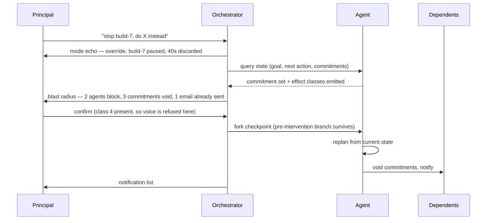
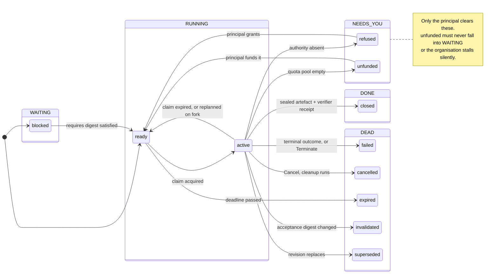
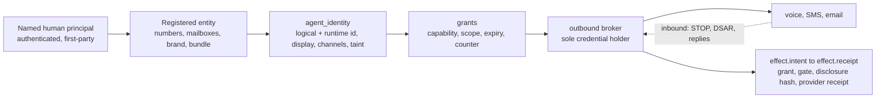

# Observability, Steering and Embodiment

**Consilient — design, 2026-08-23. DESIGN ONLY.** Three decisions gate every build unit (§What we did not resolve). Next free ADR is **0098**; 0097 is taken [measured].

---

## What this adds

The principal: he runs the organisation by talking to a Chief of Staff, and *"CEOs still jump into stuff sometimes — make that drop cheap and the return trip cheaper."* Four demands the architecture does not meet: a drop and a return that each cost one action; steering a running agent, which is a write path into live processes; a work model legible to a CEO and native to agents, from one store; embodiment, which converts most effects from reversible to irreversible.

What exists: `work_items.py` (961 lines [measured]), `coordination.py` claims, ADR-0068/0070/0071/0072, and `outbound.py` (361 lines), which sends SMS and email with **no disclosure line, no sender identity, no opt-out and no postal address** [measured]. That file is the only urgent item here.

No firsts are claimed. Temporal is multi-level over live work and write-capable, and calls itself "for debugging purposes"; Magentic-UI ships co-planning and action guards for a running multi-agent system [arXiv:2507.22358]; Claude Code ships a state-grouped roster, peek-and-answer and a background return recap; Prefect ships typed human asks with an auto-generated form [all cited]. **The gap none of the fetched sources fills**: one scannable view of *who holds an item, what it is blocked on, and spend against a prepaid balance* — bounded to pages fetched, not a market claim.

---

## Zoom levels and the surface set

One rule generates the ladder: **descending pushes a frame over a never-unmounted chat; `Esc` pops one.** The parent never leaves the screen, so the return reconstructs nothing. Overview+detail, not zooming — zooming's cost is working memory to bridge the gap [cited, DOI 10.1145/1456650.1456652 — **bibliographic record only, body unread**; used for the taxonomy in its title].

What survives at each level: `DOI(x | focus y) = API(x) − D(x,y)` [cited, Furnas, DOI 10.1145/22627.22342]. API from *blocked-on-human* (highest), *refused*, *unfunded*, *failed*, *zero float*; D from delegation depth. **Ranking and filtering, never geometric distortion** — the benefit without betting on fisheye's contested disorientation property [asserted].

| Surface | At rest | Empty / failed | The sentence (which is its job) |
|---|---|---|---|
| **S1 Chat (L0)** | Transcript, input focused, budget strip pinned | Orchestrator unreachable ⇒ strip says so with agent count; **never silence** | *"What's the state of everything?"* |
| **S2 Roster (L1a)** | Needs-you pinned, then Working / Ready / Idle / Done. Capped; overflow is a link | Stale projection ⇒ greyed with read time; absent joins render **unknown**, never inferred [measured] | *"Who's stuck?"* |
| **S3 Grid (L1b)** | Items × runs, sorted by **float ascending** — float answers "does this delay matter?" [cited, CPM, DOI 10.1145/1460299.1460318] | Malformed cell ⇒ *unreadable* glyph, raw line one key away | *"Which items keep failing?"* |
| **S4 Agent (L2a)** | Header: goal, next action, commitments, spend. Then transcript. Mode echoed in the input | Process dead ⇒ header persists with last artefact **and whether it exists** | *"Talk to build-7."* |
| **S5 Item (L2b)** | Frozen contract, state group, `is_blocked`+reason, requires/informs edges, float, effort **as a route vector** | Digest mismatch ⇒ *invalidated*, both digests shown | *"Cancel the migration, let it clean up."* |
| **S6 Step (L3)** | Raw record, verbatim + OTel GenAI span attributes [cited]. **All agent text inert**: no auto-fetched images, no HTML, no auto-followed links | Malformed ⇒ show bytes, flag, do not guess | *"Show me the call that failed."* |
| **S7 Budget (band)** | `balance · spent · committed · projected exhaustion`. Committed is the differentiator; incumbents cost after the fact [cited] | Stale ledger ⇒ **refuse to display a figure**; never interpolate from tokens | *"How much is left?"* |
| **S8 Asks (band)** | Exact question, what was tried, default if unanswered, typed form from a schema [cited, Prefect] | Unparseable schema ⇒ free text plus an unvalidated warning | *"Does anything need me?"* |
| **S9 Return brief** | L1 sorted by change, three capped sections | Nothing changed ⇒ one line, a legitimate answer | *"What did I miss?"* |
| **S10 Settings** | Search-first, `@modified` default, VS Code scope chain and filters [cited] | Refused settings **visible and locked, reason inline**, under `@haspolicy` | *"Why can't I turn off the verdict prompt?"* |

**Costs.** Drop L0→L3 unaided: 3 actions. Drop when the Chief of Staff emitted the address: **1**. Return from any depth: **1**. Re-drop within 10 min: 1. Return ≤ drop, by construction.

**Two surfaces are not chat-drivable.** S3's selection-versus-baseline explanation [cited, Honeycomb BubbleUp] is spatial. Fix: the selection primitive is a **predicate** ("items that failed twice yesterday"), which is speakable, and mouse selection compiles to the same predicate. Unbuilt, S3 is click-only and the sentence rule breaks on its flagship feature. **S10 is instrument-only** — reading a settings diff aloud is worse than not reading it.

---

## Chat and instrument, reconciled

`frontend-concepts-kimi-2026-08-20.md` refused chat-centrality and a wall-of-agents dashboard; the frozen design bar pre-registers test 4 (primary layout is state/trajectory, not a chat column). The principal has since specified chat plus voice as the zero-click default.

**The prior pass was right and I am not overturning it.** The parallelism ceiling is ~3 [algebra]; vigilance is hard mental work and is stressful [cited, Warm et al. via ADR-0035]; rendering a capability the system lacks is a vigilance task dressed as an instrument. What R8 forbade is a *complete uncapped grid*. A **state-grouped, action-sorted, capped list is not that** — at n≈3 it is three rows. **At n=50 R8 is correct and S2 is wrong.** L1 shows live agent count as a fact, never a score.

**The principal is also right.** Speech entry is 3.0× faster than mobile typing with 20.4% fewer errors [measured, arXiv:1608.07323], but speech production competes with problem-solving for the same cognitive resources [cited, Shneiderman, 10.1145/348941.348990]. **Voice owns commanding and steering; instruments own composing and auditing.** The bar's target was streaming-token theatre as the *sole* surface. That reading is [asserted] and needs an ADR.

**The return brief** is a rung, not a screen: L1 sorted by what changed, every line an address. Composed from typed events by template; the model orders and phrases only, and **any sentence not entailed by its source events is dropped, never rewritten** — abstractive summarisers hallucinated in every system evaluated [cited, DOI 10.18653/v1/2020.acl-main.173], and this is the surface read *instead of* the evidence. Ranked by predicted action, not recency: Gmail Priority Inbox measured 6% less reading overall and 13% less on unimportant mail, n≈2000 [measured]; a third of the benefit came from the per-user *threshold*, so the cut-off is a user setting. Pre-computed during the absence. Three capped sections: **Needs you**; **Shipped** (artefacts that exist, no adjectives); **Ran and failed** (the error *rendered*, not narrated — the only manipulation measured to eliminate over-reliance was a rendered error detector, ~69%→0% [cited, Vasconcelos et al.]). It is also the notification sink: interruption cost depends on where it lands [cited, DOI 10.1145/985692.985727] and opening the app is the only free breakpoint we control. Three delivery classes — immediate, held, never. No badges.

---

## Steering a running agent

**Orient on state, not transcript.** Resumption lag falls when the interrupted party gets a lag to encode a prospective goal [cited, DOI 10.1016/S1071-5819(03)00023-5 — metadata verified, abstract restricted]. Budget ten seconds: noncritical takeovers are the *slow* ones, ~3.1–11.7 s [cited, DOI 10.1177/0018720816685832 — appendix summary, re-check the PDF].

**Echo the mode.** Orchestrator vs subagent, suggestion vs override, live vs paused, discarded vs kept — all invisible, and voice removes every visual cue. Mode error is the mechanism behind automation surprises [cited, Sarter & Woods].

**Disclose blast radius before it lands.** Supervisors of fully automated processes take over worse [cited, Endsley & Kiris], and the CEO model is that condition by construction. Disclosure is the only mitigation not requiring that he watched: it substitutes consequence for situation awareness.

**Fork, never mutate; replan, never repair.** LangGraph's `update_state` branches and "does not roll back a thread" [cited], keeping the counterfactual recoverable — otherwise nobody learns the agent was right. No plan-splicer: conservative reuse is not cheaper than replanning and can be strictly harder [cited, DOI 10.1016/0004-3702(94)00082-C]. Verbs from Temporal: Signal/Query/Update/Cancel/Terminate/Reset.

**Void commitments by convention** — the rules specifying whom to inform when a commitment is dropped [cited, Jennings, DOI 10.1017/S0269888900000205]. Mark void by id and version, notify dependents, return the list; that list *is* the blast radius. Commitments must be first-class versioned objects, because asynchronous parties diverge on who owes what [cited, Chopra & Singh — **characterisation recalled, not read**]. Scerri et al. is the deployed prior art: a handover is a *transfer-of-control strategy* with a measured cost to the team [cited, DOI 10.1613/jair.1037].

**Reversibility, and where the classifier breaks.** Four classes from Claude Code's documented limits [cited]: tool-mediated and snapshotted; shell ("cannot be undone through rewind"); subagent-delegated; external. The classifier is **undecidable over shell** — `curl` is class 4 in class 2's clothes. Resolution: **shell that can reach the network or a credential is class 4 wholesale**; only a sandboxed shell with proven default-deny egress downgrades. The zero-click path therefore exists exactly where the tool surface is closed.

**Friction is proportional to irreversibility and nothing else.** Class 1: bark, done, silent fork, spoken undo window — WCAG's Reversible branch costs no conversational turn [cited, SC 3.3.4: any one of Reversible/Checked/Confirmed suffices]. Class 2/3: mode echo plus discarded-work figure. Class 4: stop and disclose **on the visual surface**. A spoken readback token is rejected: it does not repair an untrustworthy channel, it makes failure rarer and less legible. **Voice is never sufficient authority for class 4.**

---

## The work model

One store. Agents write states; the human view renders groups. Three additive changes to `work_items.py`.

**1. A declared `group` on the state definition** [cited, Plane State/StateGroup]. The ten agent-native states stay; the group is a field on the definition, so the two cannot drift.

**2. `is_blocked` + `blocked_reason` as a field, not a state** [cited, Taiga `BlockedMixin`, MPL-2.0]. Today an item cannot be running *and* blocked, which is the normal condition in a fan-out organisation. A blocker without a named cause is not representable.

**3. One soft edge, `informs`**, beside hard `requires`, carrying `{effect: duration|quality, sign, magnitude_estimate, expires_at}` — TÆMS effects reduce to exactly two measurables, and a result arriving after the consumer starts pays nothing [cited, AAAI-93, read in full]. It never gates readiness, so it cannot deadlock or stall a rival stream. **Ship the after-the-fact scoring in the same commit or do not ship the edge**; unscored it is a gaming surface. `disables` does **not** appear in that paper.

**`unfunded` is the load-bearing addition.** Under prepaid-only, an item whose route pool is empty is not blocked and not failed. In WAITING it vanishes among ordinary dependency waits and the organisation stalls with the one person who can fix it never told.

**Effort is a vector** — `{local GPU hours, prepaid VM hours, prepaid credits}` [cited, Taiga RolePoints]. A scalar total needs an exchange rate between the principal's electricity and prepaid credits, which no fact settles: USER_ONLY. Render the vector, refuse the total.

**No WIP limit.** The only real empirical study found WIP correlates with lead time *and* productivity, with no identifiable optimum [cited, Sjøberg, DOI 10.1145/3239235.3239238]. Cap the constraint instead — prepaid headroom, path conflict, review minutes — and use Little's Law to derive the delivery window, not to justify a cap. **Reforecast on buffer penetration, not lateness**: ADR-0071 fires once the commitment is already gone; escalate on consumed-buffer ÷ critical-chain-progress [cited, DOI 10.1007/978-3-642-40438-2_10].

**Why native, honestly.** EXP-16 measured 6/6 owners hitting `Status does not exist`, Linear silently coercing an invalid state, and provenance corrupting within two hops into a fabricated human-participation claim [measured]. It also measured **no** rate limits at 24 concurrent writers — so the case for native is authority and evidence, never throughput.

---

## Agent identity and embodiment

**An agent identity is a presentation layer over a registered legal person. Nothing legal attaches to the agent.** Twilio calls a number "a national resource" requiring an identified end-user [cited]; 10DLC Brands need a real tax ID [cited]; STIR/SHAKEN "A" attestation requires the right to use the number [cited]; CAN-SPAM reaches "any person acting on behalf of the sender" [cited].

Four load-bearing properties. `principal` is never null and never a display name (V0-19). `disclosure` is a **hash of pre-rendered bytes**, played in the media path before the model is bridged in — an injection can strip a prompt but not a media file; if the preamble did not play, do not bridge. `grants` are scoped, expiring and counted, which reconciles authority limits with the CEO model: *these fourteen recipients, twenty a day, seven days* is one authorisation covering a hundred actions. **`taint` is derived by the broker from the caller's capability record and never accepted as a parameter** — a caller-declared string is not authentication.

Email: per-tenant subdomain, per-agent DKIM selector, SPF/DKIM/DMARC aligned, PTR, TLS [cited, Gmail sender requirements] — **per-agent cryptographic attribution without per-agent domains**, and a subdomain that can be burned without taking human mail with it. Voices: Kokoro's 54 stock voices, Apache 2.0, cloned from nobody [cited]; cloning only for the authenticated account holder behind liveness-bound enrolment, third-party cloning refused by the product rather than discouraged by policy. Per-agent voices exist for speaker identification without visual attention, not personality.

**Inbound is a first-class obligation and every research angle missed it.** Numbers and mailboxes *receive*: opt-outs, DSARs, complaints, subpoenas. An unhandled `STOP` is a TCPA/PECR breach with the same damages as the outbound side. The broker owns inbound: `STOP`/`UNSUBSCRIBE` writes a suppression record synchronously and the dialler checks it before connect; DSAR- and legal-shaped inbound routes to a human queue and **never** into an agent's reasoning loop.

**Measurement:** provenance completeness (target 1.00 — less is a defect, not a statistic) and time-to-answer for *"who authorised this and what exactly did they hear"*, cold, by someone who did not build it: under 60 s, audio replayable. The principal already runs the incumbent — three Twilio numbers on named ElevenLabs agents [measured] — so **embodiment differentiates nothing; the accountability chain does.**

---

## The compute ladder

**Tier 0 — the user's machine.** RTX 5090, 32,607 MiB [measured, 2026-08-23]: qwen3:8b at 220 tok/s cold and **10,470 tok/s prefill** on a 14,207-token prompt; gemma4:31b at 32k context spills 13% to CPU and collapses to 28 tok/s. gpt-oss-120b needs 80 GB [cited], so **32 GB is on the wrong side of the interesting line.** Suits high input-to-output work — indexing, embedding, triage, redaction, transcription, the voice stack. Not multi-step agentic loops (28 tok/s × forty steps), deadlines, or concurrency: one GPU serialises an organisation.

*Isolation.* **Sealed:** untrusted content runs in a per-agent microVM — Docker Sandboxes works on Windows 11 + Hypervisor Platform where host sandboxes do not [cited; **GPU passthrough unverified, configure page 404'd**]. Default-deny egress through a **TLS-terminating** proxy; hostname allowlists without TLS termination fall to domain fronting, and Anthropic says so about its own [cited]. **Trusted and narrow:** work needing the user's real local state must not be sandboxed — sandboxing it is theatre, since it needs exactly the access the sandbox removes. Constrain by capability: the broker holds the token, the process sees a sentinel [cited, `mask`/`injectHosts`].

*Failure modes.* **There is no native Windows host sandbox** [cited], so today "agents work on user machines" means unsandboxed shell on the box holding every key. WSL2 mandatory; `allowUnsandboxedCommands: false`; deny-write on `~/.ssh`, `~/.aws`, `.claude/*`, `.git/hooks`, `.mcp.json`, shell rc files and `$PATH` — and close the documented gap that the list is built at launch, missing what the session creates later such as `git clone` [cited]. Second: the machine sleeps and work neither runs nor fails, so local execution must yield to the user and stalls must surface in chat unasked.

**Tier 1 — user's own cloud credentials.** Isolation is the provider's. **We cannot enforce a cutoff**: the provider bills the user, so our ceiling is advisory. Tier 1 gets a local reservation ledger and a hard refusal to launch, and the UI says plainly that this stops our agents and not the provider. **Ship this first** — zero exposure, zero chargebacks, zero support.

**Tier 2 — prepaid managed VMs (paid, not built).** GPU only. Per-run microVM (Firecracker: ≤125 ms to guest userspace, ≤5 MiB overhead [cited]). **Block 169.254.0.0/16, RFC1918 and loopback with DNS pinned between check and use** — the metadata endpoint is where an injected agent turns a text bug into cloud credentials [cited, MCP spec].

---

## Voice

Cascade, under 2 GB total, leaving ~30 GB for the model that thinks [sizes cited, arithmetic asserted]: Silero VAD (MIT, 2 MB) → Smart Turn v3.2 (BSD-2, 8 MB, ~10 ms CPU) → Parakeet TDT 0.6B (**CC-BY-4.0**, ~1.2 GB) → orchestrator → Kokoro-82M (Apache 2.0, ~0.4 GB).

**Whisper has been beaten by open weights** [measured, Open ASR Leaderboard]: Parakeet TDT 0.6B v2 at 6.05% average English WER and RTFx 3386 against Whisper large-v3's 7.44% at 145 (RTFx is H200-specific — ordinal only). **Not Moshi**, despite the better conversation at 200 ms practical [measured]: ~16 GB, and *it is the language model*, so adopting it makes the Chief of Staff a 7B speech model. **Not Piper** — `piper1-gpl` is copyleft. Parakeet's CC-BY needs a recorded decision in `adopted-deps.json`, not a default.

Three things decide whether it feels alive. **Barge-in truncation to what actually played**, not what was generated — word timestamps exist for this, and getting it wrong desynchronises the agent's memory from the human's, which is what makes voice agents feel insane rather than slow. **Backchannel classification** — a cascade treats every overlap as barge-in, so the user says "mm-hm" during a briefing and the agent stops dead, repeatedly; fix with a small classifier (short, low-energy, closed vocabulary ⇒ keep speaking). **Ambient non-speech progress** — density tracking active agents, an earcon on completion, speech only for completion, blocker or decision [cited, *Nomadic Radio*, DOI 10.1145/355324.355327 — reference verified, text unread]. Also a cost argument: narrating through paid TTS would be the product's largest line item.

Latency budget: human inter-turn gaps vary by ≤250 ms across ten languages [measured, PNAS 2009]. The usual 700–1000 ms silence threshold is several times outside normal, which is why semantic endpointing wins.

**Confirming consequential actions** follows the class table above: reversible ⇒ execute with a spoken undo window; irreversible-and-cheap ⇒ visual confirm; irreversible-and-consequential ⇒ **voice refused**. Never "Are you sure? Say yes" — a yes-bias magnet one ASR error from a wrong action.

**The countermeasure this design owes.** Speech cues significantly increased anthropomorphism *and perceived accuracy* of the information, N=2,165 [cited, arXiv:2405.06079]. Giving every agent a voice will make users believe output more, independent of correctness, in a project whose thesis is calibrated evidence. So **voice never delivers an unverified claim without saying it is unverified**; evidence tags become spoken hedges. Mitigation for a measured effect we deliberately amplify, not polish.

---

## Commercial shape

**Documented end-state. Nothing paid is built.**

**Free forever:** identity record, grants, taint, receipts; the full local voice stack; email via the user's own SMTP and domain; telephony via the user's own Twilio credentials (opt-in module); observability, steering, the work registry, the prepaid governor. A BYO-credential user becomes their own registered entity and gets **identical capability**; nothing is withheld to create an upgrade path.

**Paid:** we hold the Twilio subaccount, 10DLC Brand and Regulatory Bundle; the sending domain and DKIM keys; VM brokerage; hosted inference. Every paid row is one where **we become the registered legal person or the payer of last resort** — bundle documents, brand vetting, deliverability monitoring, AUP responsibility for end users [cited, Twilio AUP], all costing money before any usage revenue. Consequence stated up front: **instant provisioning is impossible outside the US** [cited].

**Prepaid enforcement, one structural decision: the cutoff lives in the compute's own creation-time deadline.** AWS Budgets refreshes at most three times a day and says spend may continue before notification; Google's says an alerts-only budget "doesn't automatically cap"; Stripe credits apply only at invoice finalisation, a ledger not a governor [all cited]. Every reconciliation cap has an hours-long blind window; a provider timer has none and survives an outage of our control plane.

Sequence: settled funds only → `affordable_seconds = (balance − pause_reserve − snapshot_prepay) / rate`, set as the provider's own deadline → **pause, not kill** (E2B snapshots memory and filesystem, ~4 s/GiB in, ~1 s out [cited]), the snapshot bought *before* the run starts → top-ups extend only via authenticated calls against settled funds, never via anything an agent says. Warn at T−20% and T−60 s on the stream the instrument renders; the agent uses that window to checkpoint. A cutoff is a named, queryable event, never a mystery failure [cited, Cloudflare 1102].

**Falsifiable claim:** 1,000 sandboxes run to exhaustion, maximum observed overspend **£0.00**. RunPod's 5-minute billing cycle permits a non-zero overrun [cited]; a creation-time deadline permits none. Costs a few pounds to test.

**CPU brokerage should never ship.** At 15% margin a 2 vCPU/4 GiB sandbox-hour yields ~$0.025 [cited, Daytona rates]; a UK Stripe fee on a £5 top-up is ~5.5%, so the payment fee alone exceeds a third of margin, and one ten-minute support email costs ~200 sandbox-hours of it. GPU is ~24× better per incident. Minimum top-up £10–20; credits do not expire; rates fixed at redemption. Keep the balance non-transferable and scoped to our services — Stripe prohibits credits "offered as stored value" [cited].

---

## Risk register

**DESIGN** = known engineering. **OPEN** = constrain the capability until research exists.

| # | Risk → scenario | Control | Class |
|---|---|---|---|
| R1 | **Injection reaches shell.** Retrieved bytes are instructions [measured, arXiv:2302.12173]; an ambient agent reads a page at 03:12 and curls `~/.ssh` | §Compute ladder, Tier 0 | Isolation **DESIGN**; robustness **OPEN** — 11.2% residual after dedicated mitigation on a shipped frontier product [measured] |
| R2 | **Injection reaches phone/mail.** Attacker gains a voice, a number and the user's legal person | One broker; taint derived not declared; unfamiliar recipients need a grant; volume and payload caps; full copy to trajectory | **OPEN** (see R3) |
| R3 | **Allowlisted recipient, attacker payload.** Agent mails the user's real accountant with attacker-drafted content; allowlist passes, cap passes, disclosure plays, harm lands | None. Human review of class-4 *content* is the only lever, and it is not a control | **OPEN. The likeliest real incident; neither design addressed it** |
| R4 | **Exfiltration via own channels.** Sending is the agent's purpose, so no DLP watches; image URLs, DNS, invite titles | Capability checks at tool-invocation time; no auto-fetched remote resources | **OPEN, not DESIGN.** CaMeL bought its guarantee by removing the model's authority over control flow, 84%→77% utility [measured]; checks bolted onto free control flow are a tainted-data allowlist with CaMeL's citation attached |
| R5 | **Communications law at machine speed.** EU AI Act Art. 50 applicable **since 2 Aug 2026**, to €15m/3%; FCC 24-17 makes AI voices "artificial voice", $500/call trebled, private right of action; PECR reg 19 leaves no lawful synthetic cold-call route [all cited] | Channel-layer hashed disclosure; watermarking; consent artefact checked pre-connect; **synchronous inbound STOP suppression**; v1 inbound-and-reply-only, UK permanently | **DESIGN, and overdue** |
| R6 | **UK GDPR — the store is the liability.** It retains third-party mail, transcripts and SMS from people who never consented; the asserted 4-year TCPA retention collides with minimisation | Data-protection pass before any number is provisioned: lawful basis per channel, retention per data class, DSAR path, transcript minimisation | **DESIGN, unstarted. A lawyer stops shipping here before they stop the dialler** |
| R7 | **Poisoned model or tool.** 250 documents backdoor a model regardless of scale [measured, arXiv:2510.07192] | No autonomous adoption; hash-pinned manifest; untruncated startup command shown | Gate **DESIGN**; detection **OPEN** — no method accompanies the result |
| R8 | **Ambient loop burns the balance.** F-01 measured 120 ticks reporting `working: true` while deadlocked | §Commercial shape, plus tick and wall-clock ceilings and artefact-based stall escalation. **Prepaid caps injection blast radius at the balance** | **DESIGN** |
| R9 | **Agent widens its own permissions.** A command can write shell rc files or `$PATH` and "widen its own access on the next run" [cited] | Config governing the agent is not writable by the agent | **DESIGN** |
| R10 | **Confused deputy / SSRF.** Consent-cookie skipping, token passthrough, metadata endpoint [cited, MCP spec MUSTs] | Each MUST becomes a failing acceptance test; failing one is a build break | **DESIGN** |
| R11 | **Snapshot storage liability.** We prepay 30 days from the grant; at T+30 the credit is spent and the data exists. Deleting destroys paid work; retaining is unfunded storage at next year's price, per abandoned run | Unsolved: hard deletion after two warnings, or a storage-only micro-charge | **DESIGN, unresolved. Settle before pricing** |
| R12 | **No-artefact auto-return is a free-compute oracle.** Mining, scraping and model-stealing all produce zero *declared* artefacts | Return requires a completed run with a declared-artefact attempt; egress-anomalous runs held for review, never auto-refunded | **DESIGN — the naive version ships an exploit** |
| R13 | **Agent-to-agent injection.** A manager executes a worker's prose and holds more authority | Typed schema-validated messages; transitive taint | Mechanism **DESIGN**; whether typing blocks semantic propagation **OPEN** — everything rests on transitivity working |
| R14 | **A competent agent that is simply wrong.** Uninjected, emails the wrong number. Every other row is adversarial; all nine research angles missed this | Grants bound blast radius identically; receipts make it assignable; class-4 confirmation is the only pre-check | Containment **DESIGN**; liability delegability **OPEN LAW** |
| R15 | **Trust inflation from voice.** Measured, and amplified by design [cited, N=2,165] | Spoken hedges from evidence tags; render errors rather than narrate | **DESIGN**; calibrated speech confidence **OPEN** |
| R16 | **Deliverability shared fate.** Gmail's 0.3% spam ceiling applies to the domain [cited]; one tenant silently kills all | Per-tenant subdomains; automatic hold below threshold | **DESIGN** |
| R17 | **Local model as unaligned executor.** Cheap, unmetered, unmonitored, plus R7 and R1 | Reversible work only: never a credential, never egress, never shell | Confinement **DESIGN**; trusting one with authority **OPEN — refuse, do not caveat** |
| R18 | **OSS removes enforcement.** Clone, point at own Twilio, delete the preamble ⇒ an undisclosed dialler with our README | Opt-in module; disclosure removal a visible code change, not a config flag; signed releases and forced-update path | **Mitigation, not enforcement. Say so** |
| R19 | **Chargebacks and licence contamination.** Reversal at day 90; Plane AGPL-3.0 reaches hosted offerings via §13 [cited] | Settled funds, velocity limits, low first-run ceiling, residual priced in; read semantics, never vendor code | **DESIGN** |

**Meta-risk about this document.** All nine research angles returned the same shape — a bar, a falsifiable metric, a self-objection, an evidence confessional. That is format convergence from a shared base model and brief, **not corroboration**; nine agreements are one opinion. Every angle also exhausted its web-search budget before starting, so negative claims are bounded to pages fetched. R3, R6, R11, R12 and R14 came from the critic, not the research.

---

## Build units

Buildable now — read/projection and local only; none needs D1 or D2.

| # | Deliverable | Done when | Depends on |
|---|---|---|---|
| B1 | `disclosure` a **required** field in `outbound.py`'s effect contract | `send_email`/`send_sms` refuse without it; one test asserts the refusal | — |
| B2 | Inbound STOP/opt-out suppression in the broker | A `STOP` writes a suppression record and the next send to that recipient refuses | B1 |
| B3 | Reversibility classifier; shell-with-egress ⇒ class 4 | Table-driven test over every registered tool; unknown tool ⇒ class 4 | — |
| B4 | Work-model deltas: `group`, `is_blocked`+reason, `informs` **with scoring** | Projection emits five groups; a blocker without a reason is rejected; a soft edge is scored on close | — |
| B5 | Prepaid governor: reserve-before-work, fail closed, `unfunded` | Balance hits zero mid-run, no further unit starts, item renders NEEDS-YOU | B4 |
| B6 | Voice cascade, local only, no telephony | Utterance→action end to end under 2 GB resident, measured with `nvidia-smi` | — |
| B7 | Blast-radius computation in the CLI | Prints commitments voided and dependents notified, before any confirm | B3, B4 |
| B8 | Timed battery including **arm C (chat summary)** | T1–T7 recorded on one frozen fixture | B7 |
| B9 | Adversarial suite over our own tool surface | Published, user-re-runnable; **0% on the irreversible set by construction**, honest residual plus utility cost on the reversible set | B3 |

**End-state only, gated:** the ladder S1–S10 (**D1**); the write half of steering (**D2**); telephony provisioning, hosted inference, VM brokerage (**D3** plus the R6 pass).

**Deletion rules, registered now.** If arm C wins T1–T3, delete S2 and S3 and record it: if the Chief of Staff can answer *"does anything need me"* in speech, L1 serves a user who does not exist. If return-trip time exceeds drop time, the design failed on its own terms. If β rises, the surface made the system worse regardless of the other numbers.

---

## What we did not resolve

**D1 — the surface.** ADR-0007's prohibitions on a TUI, desktop app and local web server "survive intact"; ADR-0053 fixes one offline HTML file with no server or auth [measured]. A `file://` page cannot stream state or authenticate a write. ADR-0098 must lift the prohibition with an auth design, or scope steering to the CLI and keep the surface render-only. USER_ONLY.

**D2 — the write path.** ADR-0083 records [measured] that `append()` has no cross-process serialisation and the trajectory already contains malformed concurrent lines. Steering must not ship ahead of write-ahead ordering, or a command appears accepted and is silently lost.

**D3 — telephony in the open-source tree.** Irreversible once public; no fact settles it. USER_ONLY.

Also open, named rather than buried:

- **R3**, allowlisted-recipient-with-attacker-payload. No control exists.
- **R6**, UK GDPR. No data-protection section exists in any design pass.
- **R11/R12**, snapshot liability and the refund oracle — settle before pricing is written.
- **Design-bar test 4** versus chat-plus-voice as the zero-click default. My reading is [asserted] and needs the principal.
- **S3's predicate-selection compile**, unbuilt.
- **Twilio AUP under BYO credentials** — "it's their account" is a position, not a defence, once we ship the module and market the capability.
- **Unverified, not for public prose:** the FCC ruling's date and docket; the 4-year retention period; ELVIS Act, Colorado SB 24-205, California AB 1836/2602, Utah's disclosure statute; Chatterbox's licence file; GPU passthrough in Docker Sandboxes; Smart Turn v3.2's **accuracy** (it publishes latency and no accuracy benchmark at all — measure it locally before making it the most load-bearing component in the voice design); Cockburn et al.'s empirical conclusions (body unread).
