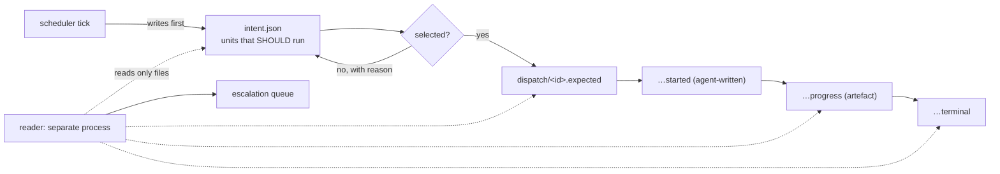

# Supervision, escalation and sessions — specification, 23 August 2026

Eleven agents. Commissioned after the principal observed that crashes were being found by him
rather than reported by the system.

**The baseline it establishes, and the number to move:** across the four failures measured here on
23 August 2026, **the detection channel was human in four of four cases.**

It also refuses to overclaim. Kubernetes surfaces a crash loop within one probe period; Erlang/OTP
escalates at one failure per five seconds; a Chubby-style lease releases in one TTL. The
specification states plainly that **we do not beat any of these on detection latency and must not
claim to** — it adopts their parameters. The available increment is escalation quality per unit of
the principal's attention.

The mechanism worth reading first is `intent`: the scheduler records what SHOULD run, with a reason
for each unit it did not select. That is the only thing here that catches the Grok failure, because
that failure produced no dispatch, no lease and no call — **nothing failed; work simply stopped
being selected**, and every other mechanism counts failures.

---

# Consilient Supervision & Escalation — Specification v1

**Conventions.** Every claim carries `[measured]` (observed on this machine or in this repository), `[cited]` (published source, fetched), or `[asserted]` (our proposal, unmeasured). Untagged prose is a build error (see BU-11). British English throughout.

---

## 1. What is broken today

Four failures, 23 August 2026 [measured, `docs/00-context/orchestration-failure-modes-2026-08-23.md`]:

| # | Failure | Time to notice | Who noticed |
|---|---|---|---|
| F-01 | Six of six dispatches died at startup; scheduler recorded them as started | unbounded | nobody |
| F-02 | Worker exited with output uncommitted; queue read idle | >1 hour | human |
| F-04 | Crashed dispatch held its lease the full hour | 1 hour | timer expiry |
| F-08 | Provider sat at 17% usage while reported busy | 2 days, 3 asks | principal |

The common property: **the detection channel was human in 4 of 4 cases** [measured]. That is the baseline number this specification exists to move.

Three of these are *loud* failures — something died. F-08 is not: nothing failed, work simply stopped being selected. The mechanisms below close the loud three completely and F-08 partially [asserted]. A fifth failure, F-11 — a unit forked from a stale base landing textually clean, green, and stale — is closed by **nothing in this specification** [measured, F-11]. See §9 and §11.

**The bar, before any claim.** Kubernetes surfaces `CrashLoopBackOff` within one probe period plus 10 s backoff, no human involved [cited, kubernetes.io Pod Lifecycle]. Erlang/OTP escalates at `intensity=1` per `period=5 s` [cited, erlang.org stdlib `supervisor`]. Sentry notifies on an unhandled exception in seconds [cited]. Chubby-style leases release in one TTL [cited, Burrows OSDI 2006]. **We do not beat any of these on detection latency and must not claim to** [asserted]. We adopt their parameters. The available increment is escalation quality per unit of the principal's attention, and it is measured in §4, not asserted here.

---

## 2. Supervision

### 2.1 Two records, not one

**`intent`** — written by the scheduler at every tick, *before* selection, naming every ready unit and, for each unit not selected, the reason (`blocked_on:<unit>`, `quota_exhausted:<arm>`, `breaker_open:<arm>`, `no_capacity`). A unit that appears with the same reason for N consecutive ticks is an event. This is the only mechanism here that catches F-08, because F-08 produced no dispatch, no lease, no call and therefore no failure to count [asserted — the critic is right that no research angle proposed this]. Default N: 6 ticks or 60 minutes, whichever is longer [asserted, preferential].

**`dispatch/<run_id>.json`** — four fields, written by the wrapper, never by the agent's goodwill:

- `expected` — written **before spawn**: run id, arm, unit, declared progress artefact, start window, progress deadline, grace. A dispatch that declares no artefact is refused at dispatch time [asserted].
- `started` — written **only** when the agent itself appends one line to a declared path. Surviving a timer is not a start. Adopting supervisord's `startsecs` alone would re-create "the wrong process was healthy for thirty minutes" at smaller scale [measured, prior failure on this machine]; s6's `notification-fd` — readiness declared by the worker — is the correct half and is **mandatory, not optional** [cited, skarnet.org/software/s6/servicedir.html].
- `progress` — `{progressed_at, artefact, bytes_or_digest, status, extend_until}`. **There is no `alive_at` field.** KIP-62's liveness/progress split is correct for Kafka, where the heartbeat proves a network peer exists [cited, KIP-62]; here it would be a PID check with a timestamp, which ADR-0034 §1 and V0-25 forbid and the code already honours [measured].
- `terminal` — exit code, **plus the list of uncommitted tracked paths**, plus claim disposition. F-02 is a missing field, not a missing algorithm [measured].

### 2.2 What artefact proves progress

Adopt Hadoop's disjunction verbatim — "neither reads an input, writes an output, nor updates its status string" [cited, verified verbatim in `mapred-default.xml`]. Concretely, any one of:

1. a new commit on the run's branch;
2. `git diff` byte count changed (`scripts/dispatch.py:git_diff_bytes` already computes this) [measured];
3. a trajectory event appended by this run;
4. a `status` line written by the agent to its declared path.

(4) is the escape hatch for legitimately quiet work and it is the weakest link: it is a self-report with no artefact behind it. It is bounded in §2.3.

**Never**: process existence, exit code, port open, log file mtime, or a heartbeat whose only content is a timestamp. Each of these has produced a false green on this machine [measured].

### 2.3 `extend_until`, bounded

A worker may buy deadline extensions (systemd `EXTEND_TIMEOUT_USEC=` [cited, man7 `sd_notify(3)`]), subject to three limits [asserted, preferential]:

- at most **2** extensions per dispatch;
- total extended deadline ≤ **2×** the original;
- every extension must carry a *changed* status string — an identical status does not extend.

Beyond that the dispatch is `stalled` regardless of what it claims. Unbounded self-extension is the mechanism eating itself.

### 2.4 Reader, backoff, quarantine

The reader is a separate process reading only files and the filesystem — the party that notices must not be the party that spawned [cited, Armstrong 2003; corroborated by OTP `supervisor` docs].

On expiry: **write a condition and stop.** Kubernetes' `progressDeadlineSeconds` sets `Progressing=False` and does not kill the pods [cited]. systemd sends SIGABRT to get a core dump, not SIGKILL [cited]. Emit `dispatch.stalled` with signal, threshold, observed value, action; capture diagnostics; terminate only if termination was authorised before the run started [asserted, following ADR-0034 §3].

Backoff: base 10 s, ×2, cap 300 s, **full jitter** `sleep = random(0, min(cap, base·2^n))` [cited, AWS Architecture Blog — >50% call-count reduction at 100 contending clients]. Counter resets after 600 s of a run that **progressed**, not one that merely lived [asserted — a process that starts and idles would otherwise reset the counter forever].

Quarantine: 2 start-failures for one unit within 600 s → state `quarantined`, retries stop, unit is visible under that name in the queue view. Loud terminal state, never a quiet loop (supervisord `FATAL`, Kubernetes `CrashLoopBackOff` as a deliberate display string) [cited, both].

Leases: 30 s TTL renewed by a live process, not 1 hour. This alone removes F-04 and is smaller than everything else in this section [cited, Chubby/etcd; asserted for the parameter].

Per-arm breaker: minimum **3** calls, 6-hour time-based window, open on 100% start-failure, 600 s open, one half-open trial. Resilience4j's `minimumNumberOfCalls=100` default is a two-day blind spot at one dispatch per hour — precisely the two days lost on F-08 [cited, resilience4j.readme.io; asserted for the re-derived values]. **Transition to OPEN is itself an escalation candidate**, not a silent routing change.

---

## 3. What repairs itself, and what must not

### 3.1 The rule

> **Automatic repair is permitted only where the repair is a no-op if the diagnosis is wrong.**

Three conditions, all properties of the repair, all required [asserted]:

1. **Harmless when misdiagnosed.** Reclaiming a lease behind an incremented fencing epoch qualifies — a live original writer is rejected, so the cost of a wrong diagnosis is one rejected write [measured, ADR-0034 §5 already decides this]. Committing a stranded worktree does not.
2. **Behaviour-preserving.** Repair may change *whether and when* work runs. It may never change *what the work computes or produces.* This excludes automatic program repair, threshold widening, dependency-edge deletion and claim-set expansion. F-11 and F-12 satisfied conditions 1 and 3 and violated this one [measured].
3. **Bounded and counted** (§3.2).

Corollary: **if the repair's correctness depends on knowing *why* the failure happened, it escalates.** Transient failures are safe to retry not because we classified them correctly but because the repair survives classifying them wrongly [cited, Gray's Heisenbug argument].

Permitted automatic repairs: restart, release lease, requeue, back off, open a breaker. Forbidden: editing source, committing on a worker's behalf, widening a gate, relaxing a threshold [asserted].

The bar for the excluded class is published and low: GenProg fixed 55/105 defects at ~$8 each [cited, ICSE 2012]; re-evaluation found correct patches in low single digits, the rest plausible-but-incorrect [cited, ISSTA 2015 / ESEC-FSE 2015]; SWE-bench+ found agent resolution falling from ~12.5% to ~4% once weak tests and leakage were filtered [cited, arXiv 2410.06992]; Meta's SapFix routes every candidate to a human [cited, ICSE-SEIP 2019]. **"Crashes get auto-fixed" is the wrong goal; "crashes get auto-reported and auto-resumed" is the right one** [asserted].

Auto-resume has a prerequisite: crash-only restart requires externalised state [cited, Candea & Fox HotOS IX], and F-02 measured that a worker can exit with output uncommitted [measured]. F-02's terminal-record field is therefore a *dependency* of auto-resume, not a parallel workstream.

### 3.2 Making repeated repair visible

Counting successful repairs per signature is necessary and insufficient. A signature counter misses the defect that presents differently each occurrence — resource exhaustion, races, quota drift, clock skew — which is three of the four measured incidents [measured]. So two counters, both required:

- **Signature counter.** Key on `stable_identity(component, error_type, error_code)`, which already exists and deliberately excludes the unit id [measured, `src/consilient/error_tracking.py:36`]. More than **3** repairs of one signature per rolling hour on one unit, or **2** across distinct units, disables repair for that signature and escalates. Sticky: cleared by a landed check or an explicit decision, not by the window rolling over [cited, systemd `reset-failed` semantics].
- **Repair ratio.** Publish `repairs ÷ commits landed`, per unit, per rolling 24 h. **Any unit whose repair count exceeds its landed-commit count is a defect, whatever the signature says** [asserted]. This is signature-independent and is the only proposed mechanism that catches the polymorphic case.
- **Aggregate budget.** Repairs may not exceed 20% of concurrent dispatches [cited, Envoy `budget_percent` default 20%, `min_retry_concurrency` 3].

**Infrastructure retries are counted.** F-05's rule — an attempt lost to infrastructure is not evidence about the work — is right about the *unit's* attempt budget and wrong as an exemption from counting [asserted, correcting the critic's identified hole]. Such retries do not consume the unit's attempts and **do** increment the repair ratio, so a permanently broken environment surfaces as a unit with 40 repairs and 0 commits rather than as an infinite quiet loop.

`prevented_recurrences()` already fires when a signature recurs after a check claimed to prevent it [measured, `error_tracking.py:186`]. Make it a CI failure, not a report line.

---

## 4. Escalation

### 4.1 Single emitter, hard budget, mandatory inhibition

Nine sources want to escalate: `start_failed`, `stalled`, `quarantined`, breaker-open, lease-expired, check-debt-aged, default-about-to-fire, supervisor-heartbeat-absent, escalation-undelivered. Unbounded, one crash on 23 August produces roughly 18 events [asserted, arithmetic over the measured trace]. Therefore:

- **One emitter.** All nine write candidates to one queue. Nothing else may notify the principal.
- **Inhibition is mandatory, not admired.** One root cause produces one escalation; a crash suppresses its own stranded-claim and blocked-downstream children [cited, Alertmanager inhibition, Apache-2.0]. NTSB found that three simultaneously-correct alerts produced a worse outcome than one would have, in two fatal accidents [cited, NTSB ASR-19-01].
- **Hard budget: 3 per rolling 24 h to the principal.** Candidates compete; the rest go to the digest (§5). A budget, not a threshold, because the ICU monitors were also only alarming on real events and produced 2,558,760 alarms in 31 days, 88.8% of annotated arrhythmia alarms false [cited, Drew et al., PLoS ONE 2014]. Google SRE's ceiling for a whole rotation is 2 incidents per 12-hour shift [cited, sre.google].
- **Precision governs the budget.** Every escalation carries `decision_changed`, set afterwards. Rolling precision below 0.7 over the last 20 escalations **halves the budget automatically** [asserted]. The system's right to interrupt is earned mechanically.

**Resolving the two ratchets.** Avoidable silences and avoidable escalations pull in opposite directions. Rule: **the silence ratchet wins below budget; the friction ratchet wins at budget** [asserted]. Under 3/24 h, raise anything that meets the test. At budget, rank and drop — and record every drop, so a suppressed true escalation is legible in the record even though it did not interrupt.

### 4.2 The escalation record

Five required fields; an escalation missing any one is refused at construction [asserted]:

1. **What stopped** — one line, in his terms.
2. **What it is holding** — leases, quota, blocked units.
3. **What I need from you** — the thing only he can supply: credential, spend, irreversible act, genuine preference. *If this cannot be filled, it is not an escalation.* This is the completion test SBAR lacks [cited: SBAR review found 8 of 26 outcomes improved and "a lack of high-quality research", BMJ Open 2018].
4. **Default if you do not reply**, and when it fires.
5. **Evidence** — the artefact itself: path, commit SHA, log line. One click, not a description.

Ordered recommendation-first. 14 CFR 25.1322 requires a flight-crew alert to let the crew identify the condition *and determine the appropriate actions* [cited, quoted in NTSB ASR-19-01] — a condition without an action is non-compliant by aviation's own standard.

### 4.3 Batching and timing

Interrupt only when the expected cost of waiting exceeds ~25 minutes of his work [asserted, from the measured cost below]. Mark, González & Harris measured resumption at **25 min 26 s** (sd 54 min 48 s), and externally-initiated resumption — which every escalation is — at **61 min 37 s** versus 21 min 28 s self-initiated [cited, CHI 2005, read from the PDF; note the widely-quoted "23 min 15 s" is not in that paper]. For programmers specifically, only 10% resume editing within a minute and ~30% take over 30 minutes [cited, Parnin & Rugaber 2011, read from the PDF].

Batch to breakpoints, not a clock — a turn ending, a dispatch closing, a gate going green, all observable here without a classifier [cited for the principle, Adamczyk & Bailey CHI 2004; asserted for the mapping]. Cap every deferral; an item whose breakpoint never arrives escapes on its deadline.

Voice opens with an announcement, then pauses — "one blocking decision, about thirty seconds" — never with content [cited, interruption-lag result via Parnin & Rugaber].

Quiet window **04:00–08:00**, into which nothing pushes: 06:00 has zero human-typed messages in 35 days [measured, 653 messages across `~/.claude/projects/**/*.jsonl`]. Do not derive rhythm from git author timestamps: they show a 02:00–05:00 bulge which is agents committing under his identity [measured].

---

## 5. The returning user

Median unattended overnight window: **11.0 hours**. First message of the working day: median 11:00 BST, p25 09:18 [measured, same corpus]. The brief is therefore **built and waiting by 09:00**, not pushed at 07:00.

It is a diff against the state he last saw, not a log — it is a resumption cue [cited, Parnin & DeLine CHI 2010 for the domain; asserted for the mapping].

**Line 1 is the verdict**, before any item: did the night advance, and is anything blocked now. One sentence. **If nothing needs him it says so and stops** [asserted] — a brief that always has content trains him to skim, which is the SRE failure quoted above [cited].

- **A — Blocked on you (n).** One line, one control each. Dispatch happens *inside* the item: approve / reject / defer is one action. Anything needing more than a binary escalates to a session (§6).
- **B — Decided without you (n).** Reversible decisions taken, each with its executable undo. This is what buys the right to act autonomously [asserted].
- **C — Failed and self-repaired (n).** Collapsed to a count, with the repair ratio beside it (§3.2). He opens it if the count surprises him.
- **D — What changed.** Diff: commits, β, gates, and the intent-record reasons for anything that did not run.

Two existing rules bind: never recompute an authoritative number, and **never render an absence as a value** — an unmeasured thing reads "not measured", never zero [measured, `dashboard.py` docstring].

Build it as a second render inside `dashboard.py`: same renderer, different selection and ordering. No server, no JS, no dependency [measured — the file is explicitly pull-only, and no push surface exists anywhere in `src/`].

---

## 6. Sessions

**Default-deny.** Escalations accumulate as briefs; each brief carries a default that fires if unanswered; most are answered by one click. A session is booked only on one of four conditions, and the request must name which [asserted]:

(a) **coupling** — two or more briefs where one answer reframes another; (b) **inherently interactive** — a credential handshake, or judging a rendered artefact; (c) **a blocking irreversible default is about to fire** unanswered; (d) he asks.

No cadence, no standing session. Quota: **1 per week**, spent from. Microsoft telemetry measured +252% meeting time and +153% meetings per person once booking friction fell, growth concentrated in short ad-hoc units [cited, Work Trend Index 2022, vendor telemetry]. External change-approval boards lengthen lead time without improving change failure rate [cited, Accelerate / DORA].

**Booking, verified by artefact.** Write an RFC 5545 VEVENT with a stable UID and hand over the `.ics`. That is the whole default implementation and needs no credential [cited, RFC 5545]. Where a calendar API is used, **read the event back by UID**; a 2xx is not a booking [asserted, per the standing rule].

**The pre-read is the product.** Every item is decidable from it. Items decided during the read drop off; **if the agenda empties, the session auto-cancels and the event is deleted, deletion verified**. Cancellation rate is the headline metric — a mechanism whose sessions always go ahead has failed at being async-first [asserted]. Having an agenda is not itself associated with meeting quality [cited, Cohen et al., Group Dynamics 2011 — identifier unverified]; the brief is.

**In session:** the existing dashboard bound to **loopback on his machine**. One item on screen, timer visible, controls below. No discussion phase — evidence arrives in writing, because groups systematically fail to surface information only one party holds [cited, Stasser & Titus 1985]. This repository already measured convening agents as worse: best in 2 of 12 versus 9 of 12 for a single agent, at 4.8× tokens [measured, ADR-0020 / EXP-16].

**Artefact:** one `decision.human` event per item into the same trajectory as every other decision — actor, session id, item id, class, choice, evidence digest, reversal path. No separate minutes format. Undecided items get a terminal disposition too (`deferred`, new default, new firing time). The session is complete only when disposed items equal sealed items; any mismatch reports itself [asserted].

Loopback is load-bearing: `transport.py` already refuses to let a non-local channel author a human verdict, precisely to stop "an agent holding a shared token laundering itself as local" [measured, V0-28].

---

## 7. Generated interfaces

**Tier 0 — fixed, versioned, never generated.** Frame, header, origin block, consequence line, and every control that commits. Consequence copy comes from templates with typed slots (`£{amount} leaves {account}; not reversible`), never model prose.

**Tier 1 — generated within a closed schema.** The model emits a session plan: JSON validated against a flat schema of primitives. It chooses which fixed components appear, their order and their content. It emits no markup, no script, no style, no live URL. Adopt MCP Elicitation's shape verbatim — flat, primitives only, three-action response accept/decline/**cancel**, origin attributed by the host [cited, MCP spec 2025-06-18, which also states "Servers MUST NOT use elicitation to request sensitive information"]. Add two fields elicitation lacks: `deadline` and `default_if_no_reply`, both required [asserted].

**Tier 2 — freely generated, sandboxed, inert.** Explanatory panels. No network, no state, no submit path.

### 7.1 Credentials — one rule, no exceptions

> **Consilient has no credential surface. Not generated, not hand-written, not on a loopback page.**

RFC 8252 §8.12: native apps **MUST NOT** use embedded user-agents, because the host "can record every keystroke entered in the login form" and users lack "the usual address bar and visible certificate validation features" [cited, verbatim]. That prohibition attaches to *control*, not to generation — hand-writing the form does not rescue it. **The `sessions` proposal that a loopback page write straight to the OS keychain is rejected**: on Windows, DPAPI states that "only a user with the same logon credential… can decrypt the data" [cited, Microsoft Learn `CryptProtectData`], so any process running as Joe can read it, and the page would be exactly the surface the other rules forbid.

Permitted, in order: (1) system browser, OAuth 2.1 + PKCE, exact-match loopback redirect, RFC 8707 `resource` indicator, short-lived token, DPoP where supported [cited, MCP authorization spec makes all of these MUST]; (2) platform passkey ceremony, where the platform supplies the origin and the authenticator renders the gesture [cited, WebAuthn L3]; (3) FIDO CTAP hybrid transport (QR + BLE), proximity-verified [cited]; (4) for a bare API key with no OAuth path, **Consilient prints the command and Joe runs it himself** — it never receives the value [asserted].

**Device-code flow is banned.** RFC 8628's own §5.4 names remote phishing and mitigates it by asking the user to confirm device possession [cited]. NIST SP 800-63B: "Authenticators that involve the manual entry of an authenticator output… SHALL NOT be considered phishing-resistant" [cited, verbatim]. Microsoft measured a state-actor campaign on this primitive running since August 2024 and now advises "get as close as possible to a unilateral block" [cited].

**Enforcement rule** (a chokepoint without one is not a chokepoint): CI greps the component registry and all emitted plans for `type: password|secret|token|apikey` and for `<input type="password">`. Non-zero matches fail the build. If it fires on a legitimate case, sharpen the discriminator; do not raise the ceiling [asserted, per F-12].

Honest limit: this stops injected script and credential harvest. It does not stop a true-but-framed consequence line assembled from an attacker-influenced crash log [cited, Greshake et al. 2302.12173 — "mitigations are currently lacking"]. See §11.

---

## 8. Live voice

**Tier 0 (default, no key, no GPU).** Kokoro-82M reads the escalation aloud locally [cited, Apache-2.0]; Silero VAD ducks the readout if he speaks [cited, MIT, <1 ms per 30 ms chunk]. One-way. This alone converts the six crashes from found-by-asking to spoken-at-the-moment [asserted].

**Tier 1 (opt-in, ~16 GB VRAM).** Kyutai Unmute, or Pipecat orchestrating Silero VAD → Smart Turn v3 → Parakeet-TDT-0.6b-v3 → local LLM → Kokoro [all cited: MIT / BSD-2 / CC-BY-4.0 / Apache-2.0]. Kyutai reports 450–750 ms on an L40S [cited] — **a datacentre card, not the target machine; consumer latency is unverified and must be measured before Tier 1 is promised** [asserted].

**Tier 2 (paid, `irreversible` severity only).** `gpt-realtime-2.1` with SIP to his phone, or Gemini Live at ~$1.38/hour of two-way audio [both cited from vendor docs].

**Rules, every tier** [asserted unless marked]:

1. **Truncate the assistant turn to what was actually heard on barge-in** [cited, LiveKit]. A transcript containing sentences he never received is the bug on an irreversible action.
2. **Endpoint semantically.** Smart Turn v3, 8 M params, ~10 ms CPU, BSD-2 [cited]. Silence timers cut people off exactly when they pause to think before authorising.
3. **Never say "sorry, could you repeat that."** Measured into the bottom tier alongside saying nothing; MoveOn and Help top the ranking [cited, Bohus & Rudnicky SIGdial 2005, read from PDF].
4. **Prefer rejection to guessing on consequential turns** — misunderstandings cost 2.24× non-understandings [cited, same].
5. **Read back the parsed action and require a distinguishing token** — an amount, a unit id, a provider name. Never bare "yes". Read-back caught 3.5% of 822 critical-value calls between trained clinicians at 12.8 s per call [cited, Barenfanger 2004]; closed-loop orders completed 3.6× sooner than open-loop [cited, El-Shafy 2018].
6. **Voice proposes; the click commits.** A human review stage cut dictation errors from 7.4 per 100 words to 0.3% in production [cited, Zhou et al., JAMA Netw Open 2018].
7. **Voice never carries a credential, never authenticates, never holds a session across a build.** Gemini caps audio sessions at 15 minutes anyway [cited]. WER differs systematically by speaker — 0.35 vs 0.19 across five commercial systems [cited, Koenecke PNAS 2020] — so calibrate per speaker and degrade to text, never a global threshold.

---

## 9. Evidence against

| Objection | Evidence | What must be true to escape it | Experiment |
|---|---|---|---|
| Auto-repair absorbs the easy class and leaves him the residue with less context | Bainbridge 1983 [cited]; Casner 2014 — cognitive skills degraded, manual did not [cited] | Every repair is visible as a defect record, and escalations ship state, not just an exception | Sample his escalation responses; measure how often he asks a clarifying question first (target 0) |
| Instructing him to be careful is not a mitigation | Parasuraman & Manzey 2010: automation bias "cannot be prevented by training or instructions" [cited] | Every defence is structural — a thing the system cannot do, or a metric that trips automatically | Audit: any defence phrased as "the principal will notice" is a defect |
| Auto-repair is a sustaining feedback loop | Bronson et al., HotOS '21 [cited] | §3.2's three counters bound it | Replay 23 Aug with repair enabled; the shared signature must trip after 2, not 6 |
| Escalation converges on alarm fatigue | 2,558,760 alarms/31 days, 88.8% false [cited] | Hard budget + inhibition + auto-halving precision | Publish rolling precision from day one |
| Approval gates get rubber-stamped | 49–96% clinical override [cited]; 70.2% Chrome SSL click-through, and click-through gets *faster* with frequency [cited, Akhawe & Felt] | No screen whose only outcomes are Approve/Reject; gates meta-monitored | Log approve-rate and median latency per gate; >0.95 with <10 s median auto-retires the gate |
| Generated UI is slower | Findlater & McGrenere CHI 2004: system-controlled significantly slower; user-controlled preferred and not slower [cited] | Fixed chrome, generated body only | A/B the brief against a fixed-layout control on time-to-decision |
| Sessions expand to fill available booking | +252% meeting time [cited] | Quota + auto-cancel | Track cancellation rate; below 50% means the async lane is failing |
| Voice error rate | 7.4 errors/100 words raw [cited] | Voice proposes only | Sample confirmed voice actions against audio; count parameter divergences |

**The objection with no escape.** Every mechanism here triggers on absence or failure. F-11 — a stale-base unit landing textually clean and green — produces neither, and the supervision layer makes it *less* visible by putting a green light beside it [measured, F-11; asserted for the consequence]. This specification does not address it and must not be described as if it does.

---

## 10. Build units

Immediately buildable; supervision and escalation first, because they are what stop the next failure being silent.

| # | Deliverable | Done criterion (checkable) | Depends on |
|---|---|---|---|
| **BU-0** | **Cheap floor.** One scheduled task: for each open `expected`, check artefact mtime and `git log`; alert on absence past grace. ~40 lines. | Replay fixture of the six 23 Aug dispatch logs emits 6 `start_failed` with zero human input, each within 60 s of child exit; healthy replay emits 0. | — |
| BU-1 | `expected` written before spawn; dispatch refused if no artefact declared | Unit test: dispatch with no `expected_artefact` raises | BU-0 |
| BU-2 | Agent-written `started` line; absence within start window ⇒ `start_failed`, no attempt consumed | Fixture: agent that exits before writing ⇒ `start_failed`; agent that writes then hangs ⇒ `stalled`, not `started`-and-healthy | BU-1 |
| BU-3 | 30 s fencing-token leases replacing 1 h | Fixture: killed dispatch's claim reclaimable in ≤30 s; displaced writer rejected on stale epoch | — |
| BU-4 | `terminal` with uncommitted-tracked-paths list | Fixture: worker exits dirty ⇒ terminal records paths and marks outcome incomplete | BU-1 |
| BU-5 | `progress` disjunction + bounded `extend_until` | Fixture: 3rd extension refused; unchanged status does not extend | BU-1 |
| BU-6 | `intent` record with non-selection reasons; N-tick repeat ⇒ event | Fixture: arm benched for 6 ticks emits `intent.starved` | — |
| BU-7 | Single escalation emitter: budget 3/24 h, mandatory inhibition, 5 required fields, precision auto-halving | Fixture: one crash ⇒ exactly 1 escalation, not 3. Escalation missing `what_i_need` refused at construction | BU-0…BU-6 |
| BU-8 | Repair counters: signature bound, repair ratio, 20% aggregate | Fixture: 40 infra-retries with 0 commits trips the ratio despite consuming no attempts | BU-7 |
| BU-9 | Morning brief as second `dashboard.py` render; verdict line; empty-state stops | Built by 09:00; renders "nothing needs you" when Block A is empty and no absence rendered as zero | BU-7 |
| BU-10 | Supervisor heartbeat to an **external** receiver; silence alarms there | Kill the loop; external receiver alarms within one period | BU-7 |
| BU-11 | **CI prose check.** Fail on superlative token (`first`, `only`, `fastest`, `best`, `unique`, `never before`, `no other`, `unprecedented`) in `docs/**` and `README` unless followed on the same line by `[cited …]` or `[measured …]`. Also fail on any claim sentence with no tag, and on any secret-bearing input type in the component registry or emitted plans. | Seeded violation of each class fails the build; clean tree passes | — |
| BU-12 | Tier 0 voice: TTS readout of escalations | Escalation is audible with no key and no GPU | BU-7 |

**Needs a decision only the principal can make** [asserted]: escalation budget value (3 is a guess); quiet-window boundaries; session quota; whether voice may take class-1 answers at all; whether a bare API key is worth supporting given §7.1's "print the command" answer; whether an external heartbeat receiver may be hosted off this machine (money, third party).

---

## 11. Open questions

1. **F-11 is unclosed.** Nothing here detects a wrong thing succeeding on time. The candidate fix is replay-onto-current-head before landing; it is a different piece of work and it is more important than most of this one [measured, F-11].
2. **The intent record needs a schedule model.** BU-6 detects a unit repeatedly not selected. It cannot detect a unit that should have been *created* and was not [asserted].
3. **The bottom turtle is a Windows scheduled task.** BU-10 moves the unsupervised root outside the loop, and the receiver is then unwatched. A network partition is indistinguishable from total failure [asserted].
4. **Nothing here was measured on his machine.** Latency, brief-reading time, precision — all borrowed. Instrument BU-7's precision and per-gate approval latency *before* the surfaces ship, or there is no baseline to fall from [asserted].
5. **Detection is the easy half.** Auto-*repair* is thin here by design; the "auto-fixed" half of the original requirement is largely refused rather than delivered, and §3 explains why [asserted].
6. **Signature granularity is a preferential parameter dressed as a hash.** No measurement is proposed for whether `component + error_type + error_code` is the right key [measured that it exists; asserted that it is unvalidated].
7. **Escalation precision is gameable by the system it governs** — optimising for `decision_changed` selects for what he reacts to, not what matters [asserted].
8. **Convergence in the source research is partly provenance.** Six angles cite the same Prometheus runbook and the same ADR-0034; that is one page read six times, not six corroborations [measured, from the research set].
9. **Nobody argued for not building it.** BU-0 alone converts all four measured incidents from human-discovered to system-reported. If BU-0 holds for a fortnight, BU-7 onward should be re-justified rather than assumed [asserted].

*Word count: ~3,950.*

---

## Adversarial critic

**1. What still goes unreported: work that was never dispatched.**
Every mechanism here fires on the *absence of an expected record*. The `expected` record is written by the dispatcher, at dispatch. A unit the scheduler simply stops selecting — because its dependency never cleared, its arm got benched, its quota pool reset wrong — writes no `expected`, holds no lease, opens no heartbeat, and trips no breaker (breakers count calls that happened). The system is byte-identical to a healthy idle night. This is the 17%-provider failure, the one that took two days and three asks, and it is the one failure of the four that **not one of the nine designs closes**. Detecting it needs a claim about what *should* have run — a scheduler-intent record, not a dispatch record. Nobody proposed one.

**2. Process-existence checks, three of them, added deliberately.**
- `alive_at` — "cheap, frequent, written by the wrapper process — proves the child exists." That is the PID check with a timestamp. The supervision angle imports it from KIP-62 and then says the project's rule is never to bind liveness to process identity. Both, in the same document.
- `startsecs` / "survives the start window" → `started`. Surviving 5 seconds is exactly "the wrong process was healthy for thirty minutes", scaled down. A dispatch that boots, loads a brief, and deadlocks passes. The s6 `notification-fd` variant is better and is offered as optional; make it mandatory or the field is decorative.
- `extend_until` — the worker buys its own deadline. A hung worker in a retry loop extends forever, and this is the only self-report in the design with no artefact behind it. It is the escape hatch that eats the mechanism.
- Minor but same species: the reaper's heartbeat *file mtime* proves the loop ticks, not that it evaluated anything; `delivered` + receipt id proves the transport accepted bytes.

**3. The repair that retries forever, by design.**
F-05's rule — "an attempt lost to infrastructure is not evidence about the work, so it does not consume a retry" — creates an explicitly **uncounted** retry class. Any unit whose environment is permanently broken (missing credential, stale worktree, path length, wrong Python) start-fails, is classified infrastructure, is requeued free, forever. Loud in the log, silent in every counter. The repair-budget proposals count `signature × window`; a defect that presents differently each occurrence (exhaustion, race, quota drift, clock skew — three of the four measured incidents) never repeats a signature and buys two free repairs indefinitely.
Recurrence becomes visible only as a **ratio**, not a count: repairs per unit of landed work. Publish `repairs / commits landed` per 24h. Any unit whose repair count exceeds its commit count is a defect, whatever the signature says.

**4. Escalation volume: nothing bounds it.**
Count the emitters proposed: `start_failed`, `stalled`, `quarantined`, breaker→OPEN, lease expired, check-debt aged, default-about-to-fire, supervisor-heartbeat-absent, escalation-undelivered. Nine sources, no shared budget, no dedup, no inhibition required (Alertmanager's inhibition is admired in four angles and made mandatory in none). Replay 23 August: six crashes × (start_failed + stranded claim + blocked downstream) ≈ 18 events before anything else fires. Only the counter-evidence angle proposes a hard cap, and it is not in any of the five constructive designs. The two ratchets — friction down, avoidable silences down — point opposite ways and no design says which wins when they collide. **Say it plainly: as specified, escalation volume is unbounded.**

**5. Credentials: mostly honest, one live contradiction.**
`credential-flows` and `generated-ui` are structurally honest — no secret-bearing field exists, enforced at build time. But the `sessions` angle recommends "the loopback page writes straight to the OS keychain" for raw API keys: a Consilient-authored page accepting a secret, which is the exact thing the other two forbid, on the platform where DPAPI gives no process isolation. Pick one. Second dishonesty, quieter: Tier 0 vs Tier 2 separation asks the principal to notice which chrome he is looking at — the thing Dhamija and Schechter measured him not doing. And "the model emits data, not markup" stops injected *script*; it does not stop a true-but-framed consequence line assembled from an attacker-influenced crash log.

**6. What the shared base and shared brief cost.**
- The brief listed four **loud** failures. Nine researchers optimised for loud. Every design detects absence; none detects a wrong thing succeeding on time. F-11 is conceded in five silence sections and closed by none — that is selection on the incident report, not analysis.
- Six angles cite the same Prometheus Watchdog runbook and the same ADR-0034. That is one page read six times and the project's own prior decision read back to it. Convergence here is provenance, not corroboration.
- Nine adversarial angles produced one architecture and disagreed substantively on exactly one point (device-code). Genuine independence would produce more conflict than that.
- Nobody costed it. Every design adds declared artefacts, windows, deadlines and defaults to every dispatch, and no one counted the lines, named what gets deleted, or proposed the cheap floor: one cron, `git log` + mtime, alert on absence. Nobody argued for not building it.
- Nobody questioned that Joe is the escalation target. Nobody measured anything on his actual machine.
